# Plan de Pruebas y Gestión de Riesgos — Ticket Service API & Contenerización

---

## Contenido

| # | Sección | Pág. |
|---|---------|------|
| 1 | [Objetivo](#1-objetivo) | 1 |
| 2 | [Descripción del Plan de Pruebas](#2-descripción-del-plan-de-pruebas) | 1 |
| 3 | [Alcance de las Pruebas](#3-alcance-de-las-pruebas) | 2 |
| 3.1 | [Dentro del Alcance](#31-dentro-del-alcance) | 2 |
| 3.2 | [Fuera del Alcance](#32-fuera-del-alcance) | 4 |
| 4 | [Niveles de Prueba](#4-niveles-de-prueba) | 5 |
| 5 | [Estrategia de las Pruebas](#5-estrategia-de-las-pruebas) | 6 |
| 5.1 | [Estrategia de Ejecución](#51-estrategia-de-ejecución) | 6 |
| 5.2 | [Estrategia de Datos](#52-estrategia-de-datos) | 7 |
| 6 | [Pruebas de Integración y Contenerización](#6-pruebas-de-integración--endpoints-api-rest) | 7 |
| 7 | [Análisis de Riesgo — Matriz de Riesgos por Criterio de Aceptación](#7-análisis-de-riesgo--matriz-de-riesgos-por-criterio-de-aceptación) | 12 |
| 8 | [Gestión de Riesgos — ISO/IEC 25010:2023](#8-gestión-de-riesgos--isoiec-250102023) | 17 |
| 9 | [Gestión de Riesgos de Proyecto](#9-gestión-de-riesgos-de-proyecto) | 26 |
| 10 | [Herramientas](#10-herramientas) | 29 |
| 11 | [Calendario de Pruebas (Cronograma)](#11-calendario-de-pruebas-cronograma) | 30 |
| 12 | [Prerequisitos](#12-prerequisitos) | 31 |
| 13 | [Acuerdos](#13-acuerdos) | 31 |
| 14 | [Equipo de Trabajo](#14-equipo-de-trabajo) | 32 |
| 15 | [Diseño de Casos de Pruebas](#15-diseño-de-casos-de-pruebas) | 33 |

---

## 1. Objetivo

Definir el plan de pruebas para la **API REST y la Contenerización del microservicio Ticket Service**, construido con Django + DDD + EDA. Este plan establece el alcance, niveles de prueba, estrategia, herramientas, cronograma y gestión de riesgos para asegurar la calidad del software según el estándar **ISO/IEC 25010:2023**.

El plan contempla pruebas unitarias de dominio, pruebas de integración para todos los endpoints de la API REST, pruebas E2E de flujos completos, pruebas de contenerización con Docker, y análisis de riesgos mapeados a las ocho características de calidad del modelo de producto de software.

---

## 2. Descripción del Plan de Pruebas

El **Ticket Service** es un microservicio de gestión de tickets de soporte que forma parte de un ecosistema distribuido. Proporciona funcionalidades de creación de tickets, cambio de estado, gestión de prioridades y respuestas de administradores a través de una API REST. Está construido con **Django REST Framework** aplicando **Domain-Driven Design (DDD)** y **Event-Driven Architecture (EDA)** con publicación de eventos a **RabbitMQ**.

### Arquitectura del sistema bajo prueba

```
Presentación (views.py, serializer.py, urls.py)
      │
      ▼
Aplicación (use_cases.py) — Casos de uso / Comandos
      │
      ▼
Dominio (entities.py, events.py, factories.py, exceptions.py)
      │
      ▼
Infraestructura (repository.py, event_publisher.py, cookie_auth.py)
      │
      ▼
Persistencia: PostgreSQL / SQLite  │  Mensajería: RabbitMQ
```

### Endpoints bajo prueba

| Método | Endpoint | Descripción | Autenticación |
|--------|----------|-------------|:-------------:|
| `GET` | `/api/tickets/` | Listar todos los tickets | Sí (JWT Cookie) |
| `POST` | `/api/tickets/` | Crear un nuevo ticket | Sí (JWT Cookie) |
| `GET` | `/api/tickets/{id}/` | Obtener detalle de un ticket | Sí (JWT Cookie) |
| `PATCH` | `/api/tickets/{id}/status/` | Cambiar estado del ticket | Sí (JWT Cookie) |
| `PATCH` | `/api/tickets/{id}/priority/` | Cambiar prioridad del ticket (solo ADMIN) | Sí (JWT Cookie) |
| `GET` | `/api/tickets/{id}/responses/` | Listar respuestas de un ticket | Sí (JWT Cookie) |
| `POST` | `/api/tickets/{id}/responses/` | Agregar respuesta al ticket (solo ADMIN) | Sí (JWT Cookie) |
| `GET` | `/api/tickets/my-tickets/{user_id}/` | Listar tickets de un usuario | Sí (JWT Cookie) |

### Historias de Usuario cubiertas

| ID | Historia de Usuario | Prioridad |
|----|---------------------|:---------:|
| STORY-1.1 | Tests E2E validando flujos completos (pytest) | Alta |
| US-001 | Deshabilitar métodos PUT/PATCH/DELETE heredados de ModelViewSet | Alta |
| US-002 | Retornar 404 cuando ticket no existe (en lugar de 400) | Alta |
| US-003 | Agregar manejo genérico de errores 500 en endpoints custom | Media |

---

## 3. Alcance de las Pruebas

### 3.1 Dentro del Alcance

#### 3.1.1 Pruebas de Integración — Endpoints de la API REST

Se verificará que cada endpoint de la API REST responda correctamente ante escenarios positivos y negativos, validando:

- Códigos de estado HTTP según la operación
- Estructura y contenido del cuerpo de respuesta (JSON)
- Validación de campos obligatorios y restricciones de serialización
- Propagación correcta de excepciones de dominio a respuestas HTTP
- Autenticación y autorización mediante cookies JWT HttpOnly (`access_token`)
- Protección XSS en campos de texto (doble capa: serializer + factory)

**Endpoints cubiertos:**

1. **Crear ticket (`POST /api/tickets/`)**
   - Creación exitosa con datos válidos (title, description, user_id) (HTTP 201)
   - Estado inicial siempre es `OPEN`, prioridad `Unassigned`
   - Rechazo por título vacío (HTTP 400)
   - Rechazo por descripción vacía (HTTP 400)
   - Rechazo por user_id vacío (HTTP 400)
   - Rechazo por HTML/scripts en título o descripción — XSS (HTTP 400)
   - Se publica evento `TicketCreated`

2. **Listar tickets (`GET /api/tickets/`)**
   - Listado exitoso con autenticación (HTTP 200)
   - Soporte de filtros por `status`, `priority`, `user_id`
   - Rechazo sin autenticación (HTTP 401)

3. **Obtener ticket (`GET /api/tickets/{id}/`)**
   - Obtención exitosa de ticket existente (HTTP 200)
   - Ticket no encontrado (HTTP 404)
   - Rechazo sin autenticación (HTTP 401)

4. **Cambiar estado (`PATCH /api/tickets/{id}/status/`)**
   - Cambio exitoso OPEN → IN_PROGRESS (HTTP 200)
   - Cambio exitoso IN_PROGRESS → CLOSED (HTTP 200)
   - Rechazo de transición inválida OPEN → CLOSED (HTTP 400)
   - Rechazo de cambio en ticket cerrado (HTTP 400)
   - Rechazo por estado inválido (HTTP 400)
   - Rechazo sin campo `status` (HTTP 400)
   - Ticket inexistente devuelve 404 (HTTP 404)
   - Error inesperado devuelve 500 genérico (HTTP 500)
   - Se publica evento `TicketStatusChanged`

5. **Cambiar prioridad (`PATCH /api/tickets/{id}/priority/`)**
   - Cambio exitoso de prioridad con rol ADMIN (HTTP 200)
   - Rechazo sin campo `priority` (HTTP 400)
   - Rechazo por prioridad inválida (HTTP 400)
   - Rechazo de transición de vuelta a Unassigned (HTTP 400)
   - Rechazo de cambio en ticket cerrado (HTTP 400)
   - Rechazo sin rol ADMIN (HTTP 403)
   - Ticket inexistente devuelve 404 (HTTP 404)
   - Error inesperado devuelve 500 genérico (HTTP 500)
   - Se publica evento `TicketPriorityChanged`

6. **Agregar respuesta (`POST /api/tickets/{id}/responses/`)**
   - Creación exitosa de respuesta con rol ADMIN (HTTP 201)
   - Rechazo sin rol ADMIN (HTTP 403)
   - Rechazo sin texto de respuesta (HTTP 400)
   - Rechazo de respuesta en ticket cerrado (HTTP 400)
   - Ticket inexistente devuelve 404 (HTTP 404)
   - Se publica evento `TicketResponseAdded`

7. **Listar respuestas (`GET /api/tickets/{id}/responses/`)**
   - Listado exitoso de respuestas (HTTP 200)
   - Ticket inexistente devuelve 404 (HTTP 404)
   - Rechazo sin permisos (no creador ni ADMIN) (HTTP 403)

8. **Tickets por usuario (`GET /api/tickets/my-tickets/{user_id}/`)**
   - Listado exitoso de tickets de un usuario (HTTP 200)
   - Error inesperado devuelve 500 genérico (HTTP 500)

9. **US-001 — Deshabilitar métodos heredados**
   - PUT genérico devuelve 405 Method Not Allowed
   - PATCH genérico devuelve 405 Method Not Allowed
   - DELETE genérico devuelve 405 Method Not Allowed
   - Endpoints custom (status, priority, responses) siguen funcionando

#### 3.1.2 Pruebas Unitarias — Capa de Dominio

- Validaciones de la entidad `Ticket` (estado, prioridad, transiciones)
- Máquina de estados: OPEN → IN_PROGRESS → CLOSED
- Transiciones de prioridad: no se puede volver a `Unassigned`
- Operación `change_status()` con idempotencia y transiciones inválidas
- Operación `change_priority()` con validación de justificación (máx. 255 chars)
- Operación `add_response()` con texto vacío y longitud máxima (2000 chars)
- Ticket cerrado no permite cambios de estado, prioridad ni respuestas
- Factory de creación de tickets (`TicketFactory`) con validación XSS
- Generación de eventos de dominio (`TicketCreated`, `TicketStatusChanged`, `TicketPriorityChanged`, `TicketResponseAdded`)

#### 3.1.3 Pruebas de Casos de Uso (con mocks)

- `CreateTicketUseCase` — flujo completo con mocks de repositorio y event publisher
- `ChangeTicketStatusUseCase` — cambio de estado con publicación de eventos
- `ChangeTicketPriorityUseCase` — cambio de prioridad con autorización y validaciones
- `AddTicketResponseUseCase` — agregar respuesta con validaciones de dominio y evento

#### 3.1.4 Pruebas E2E — Flujos Completos

Se verificarán flujos end-to-end completos que validen la cadena de operaciones:

- Flujo completo: Crear → Cambiar estado a IN_PROGRESS → Cerrar ticket
- Flujo con prioridad y respuestas: Crear → Asignar prioridad → Agregar respuesta
- Validación de errores en flujo: Intentar transiciones inválidas
- Performance: Creación y listado de 500+ tickets en <500ms

**Historias de usuario cubiertas:** STORY-1.1

#### 3.1.5 Pruebas de Contenerización — Docker

Se verificará que el servicio funcione correctamente dentro de un entorno contenerizado, validando:

- Construcción exitosa de la imagen Docker a partir del Dockerfile multi-stage
- La imagen incluye todas las dependencias de `requirements.txt`
- Configuración del servicio mediante variables de entorno
- Ejecución automática de migraciones de BD al iniciar el contenedor
- Ejecución de la suite de tests dentro del contenedor
- Orquestación con PostgreSQL y RabbitMQ vía `docker-compose.yml`

### 3.2 Fuera del Alcance

Para cada historia de usuario, los siguientes puntos están fuera del alcance del presente plan de pruebas:

1. **STORY-1.1 — Tests E2E**
   - Tests E2E contra servicios externos reales (users-service)
   - Tests de carga con miles de usuarios concurrentes
   - Tests de UI (el servicio es solo API)

2. **US-001 — Deshabilitar PUT/PATCH/DELETE heredados**
   - Verificación de que otros ViewSets (si los hubiera) aplican la misma restricción
   - Auditoría de intentos bloqueados

3. **US-002 — Retornar 404 cuando ticket no existe**
   - Verificación de respuestas 404 a nivel de middleware Django (URLs inexistentes)
   - Internacionalización de mensajes de error

4. **US-003 — Manejo genérico de errores 500**
   - Integración con servicios de monitoreo (Sentry, Datadog)
   - Log estructurado de errores 500 a sistema centralizado

5. **General**
   - Pruebas de carga y estrés (rendimiento bajo alta concurrencia sostenida)
   - Pruebas de penetración (seguridad avanzada)
   - Pruebas de interfaz de usuario (el servicio es solo API)

6. **Contenerización**
   - Optimización del tamaño de la imagen Docker
   - Escaneo de vulnerabilidades de la imagen (Trivy, Snyk)
   - Publicación de la imagen en un registro de contenedores (Docker Hub, ECR)
   - Health checks de dependencias externas (RabbitMQ, servicios downstream)
   - Rollback automático de migraciones fallidas

---

## 4. Niveles de Prueba

Se aplicarán los siguientes niveles de prueba, organizados de menor a mayor alcance:

### 4.1 Pruebas Unitarias (Unit Tests)

| Aspecto | Detalle |
|---------|---------|
| **Objetivo** | Verificar el comportamiento de componentes individuales en aislamiento |
| **Alcance** | Entidades de dominio, Factories, excepciones, eventos |
| **Dependencias** | Sin dependencias externas (sin BD, sin red) |
| **Herramienta** | `pytest` |
| **Ubicación** | `tickets/tests/unit/` |

### 4.2 Pruebas de Componente / Casos de Uso (Component Tests)

| Aspecto | Detalle |
|---------|---------|
| **Objetivo** | Verificar la lógica de orquestación de los casos de uso |
| **Alcance** | Use Cases con dependencias mockeadas (repositorio, event publisher) |
| **Dependencias** | Mocks de `TicketRepository` y `EventPublisher` |
| **Herramienta** | `pytest` + `unittest.mock` |
| **Ubicación** | `tickets/tests/unit/test_use_cases.py` |

### 4.3 Pruebas de Integración (Integration Tests)

| Aspecto | Detalle |
|---------|---------|
| **Objetivo** | Verificar el flujo completo HTTP → ViewSet → UseCase → Repository → DB |
| **Alcance** | Endpoints de la API REST con base de datos de test real |
| **Dependencias** | Django Test Client, base de datos SQLite de test, JWT |
| **Herramienta** | `pytest-django` + Django REST Framework `APIClient` |
| **Ubicación** | `tickets/tests/integration/` |

### 4.4 Pruebas E2E (End-to-End Tests)

| Aspecto | Detalle |
|---------|---------|
| **Objetivo** | Validar flujos completos de negocio (crear → actualizar → cerrar ticket) |
| **Alcance** | Cadena completa de operaciones simulando escenarios de usuario real |
| **Dependencias** | Django Test Client, base de datos de test, fixtures |
| **Herramienta** | `pytest` + fixtures + `APIClient` |
| **Ubicación** | `tickets/tests/e2e/` |

### 4.5 Pruebas de Regresión

| Aspecto | Detalle |
|---------|---------|
| **Objetivo** | Asegurar que cambios nuevos no rompen funcionalidad existente |
| **Alcance** | Suite completa de tests automatizados |
| **Ejecución** | Automatizada en cada push (CI/CD) |
| **Herramienta** | `pytest` con `--tb=short` |

### 4.6 Pruebas de Contenerización (Containerization Tests)

| Aspecto | Detalle |
|---------|--------|
| **Objetivo** | Verificar que el servicio funciona correctamente dentro de un contenedor Docker |
| **Alcance** | Construcción de imagen, configuración por variables de entorno, migraciones automáticas, ejecución de tests |
| **Dependencias** | Docker/Podman, Docker Compose, Dockerfile, docker-compose.yml |
| **Herramienta** | Docker CLI, Docker Compose / Podman Compose, `curl` |
| **Ubicación** | Ejecución manual/automatizada sobre contenedores Docker |

### Pirámide de Pruebas

```
         ╱  ╲
        ╱ E2E ╲           ← Flujos completos (STORY-1.1)
       ╱────────╲
      ╱Contenedor ╲       ← Contenerización Docker
     ╱──────────────╲
    ╱  Integración    ╲    ← Endpoints API REST (foco principal)
   ╱────────────────────╲
  ╱    Componente        ╲ ← Casos de uso con mocks
 ╱────────────────────────╲
╱       Unitarias          ╲← Dominio (entidades, factories, eventos)
╲──────────────────────────╱
```

---

## 5. Estrategia de las Pruebas

### 5.1 Estrategia de Ejecución

Las pruebas se ejecutarán en el siguiente orden:

1. **Smoke Test** — Se verificará que el servicio esté levantado y responda a `GET /api/tickets/` con un status `200`. Si el smoke test falla, no se procederá con los demás ciclos.

2. **Ciclo 1 — Pruebas funcionales y de integración** — Se ejecutarán los casos de prueba definidos para cada historia de usuario de acuerdo a los criterios de aceptación establecidos, priorizados por nivel de riesgo. Si se detectan defectos, se reportarán en el Bug Tracker para que el equipo de desarrollo los solucione.

3. **Ciclo 2 — Validación de correcciones** — Se verificarán las correcciones realizadas por el equipo de desarrollo para los defectos reportados en el Ciclo 1.

4. **Ciclo 3 — Regresión** — Se ejecutará un ciclo completo de regresión automatizada para asegurar que las correcciones no introdujeron nuevos defectos.

#### Orden de ejecución por historia de usuario (según priorización de riesgo)

De acuerdo con la identificación de riesgos en la sección 7, las pruebas se abordarán en el siguiente orden:

1. **US-001** — Deshabilitar PUT/PATCH/DELETE heredados — Riesgo promedio: **6.00**
2. **US-002** — Retornar 404 cuando ticket no existe — Riesgo promedio: **4.57**
3. **US-003** — Manejo genérico de errores 500 — Riesgo promedio: **4.00**
4. **STORY-1.1** — Tests E2E de flujos completos — Riesgo promedio: **3.25**

### 5.2 Estrategia de Datos

- Los datos de prueba se crearán mediante fixtures de pytest o directamente usando el `APIClient` de DRF.
- Para las pruebas de integración, cada test creará sus propios datos en una base de datos SQLite de test que se destruye al finalizar.
- Los tickets se crearán con `user_id` tipo `CharField` (referencia lógica, sin FK).
- Las pruebas E2E simulan flujos completos encadenando múltiples operaciones.
- El event publisher estará mockeado en tests unitarios y de componente; en tests de integración se utiliza un publisher silencioso.
- Las pruebas de contenerización utilizarán PostgreSQL como BD real vía `docker-compose.yml`.

---

## 6. Pruebas de Integración — Endpoints API REST

### 6.1 Crear Ticket (`POST /api/tickets/`)

| ID | Escenario | Método | Endpoint | Datos de Entrada | Resultado Esperado | Status |
|----|-----------|--------|----------|------------------|--------------------|--------|
| INT-CRT-001 | Creación exitosa con datos válidos | `POST` | `/api/tickets/` | `{"title": "Bug crítico", "description": "Sistema no inicia", "user_id": "user1"}` | Ticket con `status=OPEN`, `priority=Unassigned`, evento `TicketCreated` publicado | `201` |
| INT-CRT-002 | Rechazo por título vacío | `POST` | `/api/tickets/` | `{"title": "", "description": "Desc", "user_id": "user1"}` | Error de validación | `400` |
| INT-CRT-003 | Rechazo por descripción vacía | `POST` | `/api/tickets/` | `{"title": "Bug", "description": "", "user_id": "user1"}` | Error de validación | `400` |
| INT-CRT-004 | Rechazo por user_id vacío | `POST` | `/api/tickets/` | `{"title": "Bug", "description": "Desc", "user_id": ""}` | Error de validación | `400` |
| INT-CRT-005 | Rechazo por HTML en título (XSS) | `POST` | `/api/tickets/` | `{"title": "<script>alert('xss')</script>", ...}` | Error: caracteres HTML no permitidos | `400` |
| INT-CRT-006 | Rechazo por HTML en descripción (XSS) | `POST` | `/api/tickets/` | `{"description": "", ...}` | Error: caracteres HTML no permitidos | `400` |

---

### 6.2 Listar Tickets (`GET /api/tickets/`)

| ID | Escenario | Método | Endpoint | Datos de Entrada | Resultado Esperado | Status |
|----|-----------|--------|----------|------------------|--------------------|--------|
| INT-LST-001 | Listado exitoso con autenticación | `GET` | `/api/tickets/` | JWT válido | Array de tickets con `id`, `title`, `description`, `status`, `priority`, `user_id`, `created_at` | `200` |
| INT-LST-002 | Listado filtrado por status | `GET` | `/api/tickets/?status=OPEN` | JWT válido | Solo tickets con `status=OPEN` | `200` |
| INT-LST-003 | Listado rechazado sin autenticación | `GET` | `/api/tickets/` | Sin JWT | Error de autenticación | `401` |

---

### 6.3 Obtener Ticket por ID (`GET /api/tickets/{id}/`)

| ID | Escenario | Método | Endpoint | Datos de Entrada | Resultado Esperado | Status |
|----|-----------|--------|----------|------------------|--------------------|--------|
| INT-GET-001 | Ticket encontrado | `GET` | `/api/tickets/{id}/` | ID existente, JWT válido | Datos del ticket con respuestas | `200` |
| INT-GET-002 | Ticket no encontrado | `GET` | `/api/tickets/{id}/` | ID inexistente, JWT válido | `{"detail": "Not found."}` | `404` |
| INT-GET-003 | Sin autenticación rechazado | `GET` | `/api/tickets/{id}/` | Sin JWT | Error de autenticación | `401` |

---

### 6.4 US-002: Cambiar Estado de Ticket (`PATCH /api/tickets/{id}/status/`)

| ID | Escenario | Método | Endpoint | Datos de Entrada | Resultado Esperado | Status |
|----|-----------|--------|----------|------------------|--------------------|--------|
| INT-STS-001 | Cambio exitoso OPEN → IN_PROGRESS | `PATCH` | `/api/tickets/{id}/status/` | `{"status": "IN_PROGRESS"}` | Ticket con `status=IN_PROGRESS`, evento `TicketStatusChanged` | `200` |
| INT-STS-002 | Cambio exitoso IN_PROGRESS → CLOSED | `PATCH` | `/api/tickets/{id}/status/` | `{"status": "CLOSED"}` | Ticket con `status=CLOSED` | `200` |
| INT-STS-003 | Transición inválida OPEN → CLOSED | `PATCH` | `/api/tickets/{id}/status/` | `{"status": "CLOSED"}` (ticket OPEN) | Error: transición no permitida | `400` |
| INT-STS-004 | Ticket cerrado rechaza cambio | `PATCH` | `/api/tickets/{id}/status/` | `{"status": "IN_PROGRESS"}` (ticket CLOSED) | Error: ticket cerrado | `400` |
| INT-STS-005 | Estado inválido | `PATCH` | `/api/tickets/{id}/status/` | `{"status": "INVALID_STATE"}` | Error: estado inválido | `400` |
| INT-STS-006 | Campo 'status' ausente | `PATCH` | `/api/tickets/{id}/status/` | `{}` | `{"error": "El campo 'status' es requerido"}` | `400` |
| INT-STS-007 | Ticket inexistente devuelve 404 | `PATCH` | `/api/tickets/999/status/` | `{"status": "CLOSED"}` | `{"error": "Ticket 999 no encontrado"}` | `404` |
| INT-STS-008 | Error inesperado devuelve 500 | `PATCH` | `/api/tickets/{id}/status/` | Excepción simulada en repositorio | `{"error": "Error interno del servidor"}` | `500` |

---

### 6.5 US-002: Cambiar Prioridad de Ticket (`PATCH /api/tickets/{id}/priority/`)

| ID | Escenario | Método | Endpoint | Datos de Entrada | Resultado Esperado | Status |
|----|-----------|--------|----------|------------------|--------------------|--------|
| INT-PRI-001 | Cambio exitoso con rol ADMIN | `PATCH` | `/api/tickets/{id}/priority/` | `{"priority": "High", "justification": "Urgente"}`, rol ADMIN | Ticket con `priority=High`, evento `TicketPriorityChanged` | `200` |
| INT-PRI-002 | Campo 'priority' ausente | `PATCH` | `/api/tickets/{id}/priority/` | `{}` | `{"error": "El campo 'priority' es requerido"}` | `400` |
| INT-PRI-003 | Prioridad inválida | `PATCH` | `/api/tickets/{id}/priority/` | `{"priority": "Urgent"}` | Error: prioridad inválida | `400` |
| INT-PRI-004 | No puede volver a Unassigned | `PATCH` | `/api/tickets/{id}/priority/` | `{"priority": "Unassigned"}` (ticket con priority=Medium) | Error: transición inválida | `400` |
| INT-PRI-005 | Ticket cerrado rechaza cambio | `PATCH` | `/api/tickets/{id}/priority/` | `{"priority": "High"}` (ticket CLOSED) | Error: ticket cerrado | `400` |
| INT-PRI-006 | Sin rol ADMIN rechazado | `PATCH` | `/api/tickets/{id}/priority/` | `{"priority": "High"}`, rol USER | `{"error": "Permiso insuficiente..."}` | `403` |
| INT-PRI-007 | Ticket inexistente devuelve 404 | `PATCH` | `/api/tickets/999/priority/` | `{"priority": "High"}` | `{"error": "Ticket 999 no encontrado"}` | `404` |
| INT-PRI-008 | Justificación excede 255 caracteres | `PATCH` | `/api/tickets/{id}/priority/` | `{"priority": "High", "justification": "a" * 256}` | Error: justificación excede longitud | `400` |

---

### 6.6 US-002: Agregar Respuesta (`POST /api/tickets/{id}/responses/`)

| ID | Escenario | Método | Endpoint | Datos de Entrada | Resultado Esperado | Status |
|----|-----------|--------|----------|------------------|--------------------|--------|
| INT-RES-001 | Respuesta creada exitosamente | `POST` | `/api/tickets/{id}/responses/` | `{"text": "Investigando", "admin_id": "admin1"}`, rol ADMIN | Respuesta con `text`, `admin_id`, `created_at`, evento `TicketResponseAdded` | `201` |
| INT-RES-002 | Sin rol ADMIN rechazado | `POST` | `/api/tickets/{id}/responses/` | `{"text": "Prueba", "admin_id": "user1"}`, rol USER | `{"error": "Solo los administradores..."}` | `403` |
| INT-RES-003 | Texto de respuesta vacío | `POST` | `/api/tickets/{id}/responses/` | `{"text": "", "admin_id": "admin1"}` | Error: texto obligatorio | `400` |
| INT-RES-004 | Ticket cerrado rechaza respuesta | `POST` | `/api/tickets/{id}/responses/` | `{"text": "Prueba", "admin_id": "admin1"}` (ticket CLOSED) | Error: ticket cerrado | `400` |
| INT-RES-005 | Ticket inexistente devuelve 404 | `POST` | `/api/tickets/999/responses/` | `{"text": "Prueba", "admin_id": "admin1"}` | `{"error": "Ticket 999 no encontrado"}` | `404` |
| INT-RES-006 | Texto excede 2000 caracteres | `POST` | `/api/tickets/{id}/responses/` | `{"text": "a" * 2001, "admin_id": "admin1"}` | Error: texto excede longitud | `400` |

---

### 6.7 Listar Respuestas (`GET /api/tickets/{id}/responses/`)

| ID | Escenario | Método | Endpoint | Datos de Entrada | Resultado Esperado | Status |
|----|-----------|--------|----------|------------------|--------------------|--------|
| INT-LRS-001 | Listado exitoso de respuestas | `GET` | `/api/tickets/{id}/responses/` | JWT válido (ADMIN o creador) | Array de respuestas con `id`, `text`, `admin_id`, `created_at` | `200` |
| INT-LRS-002 | Ticket inexistente devuelve 404 | `GET` | `/api/tickets/999/responses/` | JWT válido (no ADMIN) | `{"error": "Ticket 999 no encontrado"}` | `404` |
| INT-LRS-003 | Sin permisos (no creador ni ADMIN) | `GET` | `/api/tickets/{id}/responses/` | JWT válido (otro usuario) | `{"error": "No tienes permiso..."}` | `403` |

---

### 6.8 Tickets por Usuario (`GET /api/tickets/my-tickets/{user_id}/`)

| ID | Escenario | Método | Endpoint | Datos de Entrada | Resultado Esperado | Status |
|----|-----------|--------|----------|------------------|--------------------|--------|
| INT-MYT-001 | Listado exitoso de tickets del usuario | `GET` | `/api/tickets/my-tickets/user1/` | JWT válido | Array de tickets del usuario user1 | `200` |
| INT-MYT-002 | Usuario sin tickets | `GET` | `/api/tickets/my-tickets/nouser/` | JWT válido | Array vacío | `200` |
| INT-MYT-003 | Error inesperado devuelve 500 | `GET` | `/api/tickets/my-tickets/{user_id}/` | Excepción simulada | `{"error": "Error interno del servidor"}` | `500` |

---

### 6.9 US-001: Deshabilitar Métodos Heredados

| ID | Escenario | Método | Endpoint | Datos de Entrada | Resultado Esperado | Status |
|----|-----------|--------|----------|------------------|--------------------|--------|
| INT-DIS-001 | PUT genérico devuelve 405 | `PUT` | `/api/tickets/{id}/` | `{"title": "Nuevo título"}` | Method Not Allowed | `405` |
| INT-DIS-002 | PATCH genérico devuelve 405 | `PATCH` | `/api/tickets/{id}/` | `{"title": "Nuevo título"}` | Method Not Allowed | `405` |
| INT-DIS-003 | DELETE genérico devuelve 405 | `DELETE` | `/api/tickets/{id}/` | — | Method Not Allowed | `405` |
| INT-DIS-004 | Endpoint custom /status/ sigue funcionando | `PATCH` | `/api/tickets/{id}/status/` | `{"status": "IN_PROGRESS"}` | Cambio de estado exitoso | `200` |
| INT-DIS-005 | Endpoint custom /priority/ sigue funcionando | `PATCH` | `/api/tickets/{id}/priority/` | `{"priority": "High", "justification": "Urgente"}` (ADMIN) | Cambio de prioridad exitoso | `200` |
| INT-DIS-006 | Endpoint custom /responses/ sigue funcionando | `POST` | `/api/tickets/{id}/responses/` | `{"text": "Resuelto", "admin_id": "admin1"}` (ADMIN) | Respuesta creada | `201` |

---

### 6.10 Pruebas de Contenerización

#### Construcción de Imagen Docker

| ID | Escenario | Comando/Acción | Datos de Entrada | Resultado Esperado | Verificación |
|----|-----------|----------------|------------------|--------------------|--------------|
| CNT-BLD-001 | Build exitoso de la imagen (multi-stage) | `docker build -t ticket-service .` | Dockerfile válido | Imagen construida sin errores, base Python 3.12-slim, multi-stage build | `OK` |
| CNT-BLD-002 | Dependencias instaladas en la imagen | `docker run ticket-service pip list` | — | Todas las dependencias de `requirements.txt` presentes | `OK` |
| CNT-BLD-003 | Archivos innecesarios excluidos | `docker run ticket-service ls -la` | `.dockerignore` configurado | Sin directorio `venv` ni archivos `.git` en la imagen | `OK` |
| CNT-BLD-004 | Usuario no-root configurado | `docker run ticket-service whoami` | — | Usuario `app` (no `root`) | `OK` |

#### Configuración por Variables de Entorno

| ID | Escenario | Comando/Acción | Datos de Entrada | Resultado Esperado | Verificación |
|----|-----------|----------------|------------------|--------------------|--------------|
| CNT-ENV-001 | Conexión a PostgreSQL | `podman-compose up -d` | `POSTGRES_DB`, `POSTGRES_USER`, `POSTGRES_PASSWORD`, `POSTGRES_HOST` | Conexión a PostgreSQL exitosa, migraciones aplicadas | `OK` |
| CNT-ENV-002 | RabbitMQ host configurable | `podman-compose up -d` | Servicio `rabbitmq` en compose | Event publisher se conecta al host especificado | `OK` |
| CNT-ENV-003 | DJANGO_SETTINGS_MODULE configurable | `podman-compose up -d` | `DJANGO_SETTINGS_MODULE=ticket_service.settings` | Servicio usa settings correctos | `OK` |

#### Migraciones Automáticas al Arrancar

| ID | Escenario | Comando/Acción | Datos de Entrada | Resultado Esperado | Verificación |
|----|-----------|----------------|------------------|--------------------|--------------|
| CNT-MIG-001 | Primer arranque aplica migraciones | `podman-compose up -d` | BD vacía | `python manage.py migrate` ejecutado, tablas creadas | `OK` |
| CNT-MIG-002 | Arranque posterior sin errores | `podman-compose restart backend` | Migraciones ya aplicadas | Comando `migrate` no produce errores, servicio inicia normalmente | `OK` |

#### Ejecución de Tests en Contenedor

| ID | Escenario | Comando/Acción | Datos de Entrada | Resultado Esperado | Verificación |
|----|-----------|----------------|------------------|--------------------|--------------|
| CNT-TST-001 | Tests unitarios pasan sin BD | `podman-compose exec backend pytest tickets/tests/unit/ -v` | — | Todos los tests de dominio pasan, sin conexión a BD | `OK` |
| CNT-TST-002 | Tests de integración pasan | `podman-compose exec backend python manage.py test tickets.tests.integration --verbosity=2` | BD PostgreSQL de test | Django crea BD de test, todos los tests pasan | `OK` |
| CNT-TST-003 | Tests E2E pasan | `podman-compose exec backend pytest tickets/tests/e2e/ -v` | BD de test | Todos los tests E2E pasan | `OK` |

---

## 7. Análisis de Riesgo — Matriz de Riesgos por Criterio de Aceptación

La probabilidad está definida en un rango de 1 a 3:
- **1** = Probabilidad baja
- **2** = Probabilidad media
- **3** = Probabilidad alta

El impacto está definido en un rango de 1 a 3:
- **1** = Impacto bajo
- **2** = Impacto medio
- **3** = Impacto alto

**Riesgo = Probabilidad × Impacto**

Tipo de ejecución: **Manual** o **Automatizada**.

---

### STORY-1.1: Tests E2E validando flujos completos

| Criterio de Aceptación | Prob. | Imp. | Riesgo | Tipo |
|------------------------|:-----:|:----:|:------:|------|
| CA001: El flujo Crear → IN_PROGRESS → CLOSED funciona correctamente, retornando status 201, 200, 200 respectivamente. | 1 | 3 | 3 | Automatizada |
| CA002: El flujo con prioridad y respuestas (crear → asignar prioridad Medium → agregar respuesta) funciona completo. | 1 | 2 | 2 | Automatizada |
| CA003: Al intentar una transición inválida (CLOSED → OPEN), se recibe 400 con mensaje descriptivo. | 1 | 3 | 3 | Automatizada |
| CA004: Con 500+ tickets en BD, el GET /api/tickets/ responde en <500ms y puede filtrar sin timeouts. | 2 | 2 | 4 | Automatizada |

**Promedio del riesgo: 3.00**

---

### US-001: Deshabilitar métodos PUT/PATCH/DELETE heredados de ModelViewSet

| Criterio de Aceptación | Prob. | Imp. | Riesgo | Tipo |
|------------------------|:-----:|:----:|:------:|------|
| CA001: PUT a /api/tickets/{id}/ devuelve 405 Method Not Allowed y el ticket NO es modificado. | 2 | 3 | 6 | Automatizada |
| CA002: PATCH a /api/tickets/{id}/ devuelve 405 Method Not Allowed y el ticket NO es modificado. | 2 | 3 | 6 | Automatizada |
| CA003: DELETE a /api/tickets/{id}/ devuelve 405 Method Not Allowed y el ticket se mantiene intacto. | 2 | 3 | 6 | Automatizada |
| CA004: PATCH a /api/tickets/{id}/status/ con {"status": "IN_PROGRESS"} sigue retornando 200 OK. | 1 | 3 | 3 | Automatizada |
| CA005: PATCH a /api/tickets/{id}/priority/ con {"priority": "High"} (ADMIN) sigue retornando 200 OK. | 1 | 3 | 3 | Automatizada |
| CA006: POST a /api/tickets/{id}/responses/ (ADMIN) sigue retornando 201 Created y se publica evento. | 1 | 3 | 3 | Automatizada |

**Promedio del riesgo: 4.50**

---

### US-002: Retornar 404 cuando ticket no existe

| Criterio de Aceptación | Prob. | Imp. | Riesgo | Tipo |
|------------------------|:-----:|:----:|:------:|------|
| CA001: PATCH a /api/tickets/999/status/ con ticket 999 inexistente devuelve 404 con `{"error": "Ticket 999 no encontrado"}`. | 2 | 3 | 6 | Automatizada |
| CA002: PATCH a /api/tickets/999/priority/ con ticket 999 inexistente devuelve 404 con `{"error": "Ticket 999 no encontrado"}`. | 2 | 3 | 6 | Automatizada |
| CA003: POST a /api/tickets/999/responses/ con ticket 999 inexistente devuelve 404. | 2 | 3 | 6 | Automatizada |
| CA004: Campo 'status' ausente en change_status sigue devolviendo 400 con `{"error": "El campo 'status' es requerido"}`. | 1 | 2 | 2 | Automatizada |
| CA005: Estado inválido en change_status sigue devolviendo 400 con mensaje de error descriptivo. | 1 | 2 | 2 | Automatizada |
| CA006: Campo 'priority' ausente en change_priority sigue devolviendo 400 con `{"error": "El campo 'priority' es requerido"}`. | 1 | 2 | 2 | Automatizada |
| CA007: Ticket cerrado en change_status sigue devolviendo 400 con error sobre ticket cerrado. | 1 | 3 | 3 | Automatizada |
| CA008: Usuario no ADMIN intenta responder devuelve 403 Forbidden. | 2 | 3 | 6 | Automatizada |

**Promedio del riesgo: 4.13**

---

### US-003: Manejo genérico de errores 500 en endpoints custom

| Criterio de Aceptación | Prob. | Imp. | Riesgo | Tipo |
|------------------------|:-----:|:----:|:------:|------|
| CA001: Excepción inesperada en change_status devuelve 500 con `{"error": "Error interno del servidor"}` sin stacktrace. | 2 | 3 | 6 | Automatizada |
| CA002: Excepción inesperada en change_priority devuelve 500 con `{"error": "Error interno del servidor"}` sin stacktrace. | 2 | 3 | 6 | Automatizada |
| CA003: ValueError en change_status sigue siendo 400. | 1 | 2 | 2 | Automatizada |
| CA004: TicketAlreadyClosed en change_status sigue siendo 400. | 1 | 2 | 2 | Automatizada |
| CA005: Ausencia de campo requerido sigue siendo 400. | 1 | 2 | 2 | Automatizada |
| CA006: Endpoint my_tickets con excepción inesperada devuelve 500. | 2 | 3 | 6 | Automatizada |
| CA007: InvalidPriorityTransition en change_priority sigue siendo 400. | 1 | 2 | 2 | Automatizada |
| CA008: PermissionDenied (DomainException) en change_priority sigue siendo 403. | 2 | 3 | 6 | Automatizada |

**Promedio del riesgo: 4.00**

---

### Resumen de Priorización por Riesgo

| Prioridad | Historia de Usuario | Riesgo Promedio |
|:---------:|---------------------|:---------------:|
| 1 | US-001 — Deshabilitar PUT/PATCH/DELETE heredados | **4.50** |
| 2 | US-002 — Retornar 404 cuando ticket no existe | **4.13** |
| 3 | US-003 — Manejo genérico de errores 500 | **4.00** |
| 4 | STORY-1.1 — Tests E2E de flujos completos | **3.00** |

---

## 8. Gestión de Riesgos — ISO/IEC 25010:2023

Esta sección identifica, categoriza, evalúa y prioriza los riesgos del sistema basándose en el estándar **ISO/IEC 25010:2023** (Modelo de calidad de producto de software), que define ocho características de calidad:

1. Adecuación Funcional
2. Eficiencia de Desempeño
3. Compatibilidad
4. Usabilidad
5. Fiabilidad
6. Seguridad
7. Mantenibilidad
8. Portabilidad

Los riesgos se mapean a estas características para asegurar una cobertura exhaustiva y sistemática.

### Escala de evaluación

| Nivel | Probabilidad | Impacto |
|:-----:|:------------|:--------|
| **1** | Baja — Poco probable que ocurra | Bajo — Efecto mínimo en el sistema |
| **2** | Media — Puede ocurrir bajo ciertas condiciones | Medio — Afecta funcionalidad parcial |
| **3** | Alta — Es probable o ya se ha manifestado | Alto — Afecta funcionalidad crítica o seguridad |

**Severidad = Probabilidad × Impacto** (rango 1–9)

| Severidad | Clasificación | Acción |
|:---------:|:-------------|:-------|
| 1–2 | 🟢 Baja | Monitorear |
| 3–4 | 🟡 Media | Mitigar con pruebas regulares |
| 6 | 🟠 Alta | Mitigar con pruebas automatizadas y plan de acción |
| 9 | 🔴 Crítica | Acción inmediata, bloqueo de release |

---

### 8.1 Adecuación Funcional

> *Grado en que el producto proporciona funciones que satisfacen las necesidades declaradas e implícitas cuando se usa bajo condiciones especificadas.*

| ID | Riesgo | Subcaracterística | Prob. | Imp. | Sev. | Endpoint Afectado | Mitigación |
|----|--------|-------------------|:-----:|:----:|:----:|-------------------|------------|
| AF-001 | La máquina de estados permite una transición inválida (OPEN → CLOSED directamente) | Corrección Funcional | 1 | 3 | 🟡 3 | `PATCH /api/tickets/{id}/status/` | Test INT-STS-003 automatizado. Validación en entidad de dominio `Ticket._validate_state_transition()`. |
| AF-002 | Un ticket cerrado acepta cambios de estado, prioridad o respuestas | Corrección Funcional | 1 | 3 | 🟡 3 | Todos los endpoints de mutación | Tests INT-STS-004, INT-PRI-005, INT-RES-004. Método `_ensure_not_closed()` en entidad. |
| AF-003 | Los métodos PUT/PATCH/DELETE heredados de ModelViewSet permiten bypass del dominio | Completitud Funcional | 2 | 3 | 🟠 6 | `PUT/PATCH/DELETE /api/tickets/{id}/` | Tests INT-DIS-001 a 003. ViewSet hereda solo `CreateModelMixin`, `RetrieveModelMixin`, `ListModelMixin`. |
| AF-004 | La factory no detecta HTML/scripts en título o descripción, permitiendo Stored XSS | Corrección Funcional | 2 | 3 | 🟠 6 | `POST /api/tickets/` | Tests INT-CRT-005, INT-CRT-006. Doble validación: serializer + `TicketFactory`. |
| AF-005 | `add_response()` acepta texto vacío o excesivamente largo | Completitud Funcional | 1 | 2 | 🟢 2 | `POST /api/tickets/{id}/responses/` | Tests INT-RES-003, INT-RES-006. Validación en `Ticket._validate_response_text()`. |
| AF-006 | Evento `TicketResponseAdded` no se publica al agregar respuesta | Completitud Funcional | 2 | 3 | 🟠 6 | `POST /api/tickets/{id}/responses/` | Test con mock de EventPublisher para verificar publicación. |
| AF-007 | Cambio de prioridad no valida transiciones (permite volver a Unassigned) | Corrección Funcional | 1 | 2 | 🟢 2 | `PATCH /api/tickets/{id}/priority/` | Test INT-PRI-004. Validación `_validate_priority_transition()` en entidad. |

---

### 8.2 Eficiencia de Desempeño

> *Desempeño relativo a la cantidad de recursos utilizados bajo condiciones determinadas.*

| ID | Riesgo | Subcaracterística | Prob. | Imp. | Sev. | Endpoint Afectado | Mitigación |
|----|--------|-------------------|:-----:|:----:|:----:|-------------------|------------|
| ED-001 | El endpoint `GET /api/tickets/` no implementa paginación eficiente, degradando rendimiento con volúmenes altos (500+ tickets) | Comportamiento Temporal | 2 | 2 | 🟡 4 | `GET /api/tickets/` | Test E2E de performance con 500+ tickets. El `queryset` usa `order_by("-created_at")`. |
| ED-002 | La conexión a RabbitMQ en cada publicación de evento genera latencia y timeouts | Comportamiento Temporal | 2 | 2 | 🟡 4 | Todos los endpoints con eventos | Monitorear. `RabbitMQEventPublisher` abre/cierra conexión por evento. |
| ED-003 | El endpoint `my_tickets` ejecuta queries sin paginación | Utilización de Recursos | 2 | 2 | 🟡 4 | `GET /api/tickets/my-tickets/{user_id}/` | Monitorear tiempos de respuesta. Considerar paginación futura. |
| ED-004 | El repositorio `to_django_model()` ejecuta query adicional `SELECT` para conversión | Comportamiento Temporal | 1 | 1 | 🟢 1 | Endpoints que usan repository | Monitorear. Overhead aceptable para volumen esperado. |

---

### 8.3 Compatibilidad

> *Grado en que un producto puede intercambiar información con otros productos y/o realizar sus funciones requeridas mientras comparte el mismo entorno.*

| ID | Riesgo | Subcaracterística | Prob. | Imp. | Sev. | Endpoint Afectado | Mitigación |
|----|--------|-------------------|:-----:|:----:|:----:|-------------------|------------|
| CO-001 | Los eventos publicados a RabbitMQ (exchange `tickets`, fanout) tienen formato no documentado formalmente | Interoperabilidad | 2 | 3 | 🟠 6 | Eventos `TicketCreated`, `TicketStatusChanged`, `TicketPriorityChanged`, `TicketResponseAdded` | Documentar schema de eventos en ARCHITECTURE.md. Tests de contrato para validar estructura. |
| CO-002 | El `user_id` como `CharField` sin FK asume que el users-service proporciona IDs compatibles | Interoperabilidad | 1 | 2 | 🟢 2 | Todos los endpoints con `user_id` | Documentar contrato entre servicios. Validación básica de `user_id` no vacío. |
| CO-003 | La cookie JWT HttpOnly `access_token` no es compatible con clientes que no soportan cookies | Coexistencia | 2 | 2 | 🟡 4 | Todos los endpoints autenticados | Documentar limitación. `CookieJWTStatelessAuthentication` lee de cookie. |

---

### 8.4 Usabilidad

> *Grado en que un producto puede ser utilizado por usuarios específicos para lograr objetivos específicos con eficacia, eficiencia y satisfacción.*

| ID | Riesgo | Subcaracterística | Prob. | Imp. | Sev. | Endpoint Afectado | Mitigación |
|----|--------|-------------------|:-----:|:----:|:----:|-------------------|------------|
| US-001 | Mensajes de error no son suficientemente descriptivos para determinar la causa del fallo | Reconocimiento de Adecuación | 2 | 2 | 🟡 4 | Todos | Verificar mensajes de error en excepciones de dominio. Cada excepción incluye contexto (ticket_id, campo). |
| US-002 | La API no diferencia entre 400 y 404 consistentemente, confundiendo al consumidor | Operabilidad | 2 | 2 | 🟡 4 | Endpoints con `{id}` | Tests US-002 verifican semántica HTTP correcta. `TicketNotFoundException` → 404, `ValueError` → 400. |
| US-003 | Los errores 500 exponen stacktraces en modo DEBUG, revelando detalles técnicos | Facilidad de Aprendizaje | 1 | 3 | 🟡 3 | Todos | Tests US-003 verifican que 500 retorna `{"error": "Error interno del servidor"}` sin stacktrace. |

---

### 8.5 Fiabilidad

> *Grado en que un sistema realiza funciones específicas bajo condiciones específicas durante un período de tiempo establecido.*

| ID | Riesgo | Subcaracterística | Prob. | Imp. | Sev. | Endpoint Afectado | Mitigación |
|----|--------|-------------------|:-----:|:----:|:----:|-------------------|------------|
| FI-001 | La caída de RabbitMQ causa que las operaciones (crear ticket, cambiar estado) fallen completamente | Tolerancia a Fallos | 1 | 3 | 🟡 3 | Todos los endpoints con eventos | Verificar que `RabbitMQEventPublisher` tiene try/catch silencioso. La operación de negocio debe completarse. |
| FI-002 | Excepciones no previstas en `change_status` o `change_priority` provocan respuestas inconsistentes o 500 sin formato | Recuperabilidad | 2 | 3 | 🟠 6 | `PATCH .../status/`, `PATCH .../priority/` | US-003 agrega `except Exception` catch-all con respuesta 500 genérica. Tests automatizados. |
| FI-003 | Una interrupción durante la transacción atómica en `_create_response` deja datos inconsistentes | Recuperabilidad | 1 | 3 | 🟡 3 | `POST /api/tickets/{id}/responses/` | Se usa `transaction.atomic()` para rollback automático. |
| FI-004 | El servicio no se recupera automáticamente después de una caída de la BD PostgreSQL | Disponibilidad | 2 | 3 | 🟠 6 | Todos | Docker Compose `depends_on: condition: service_healthy` para BD. |

---

### 8.6 Seguridad

> *Grado en que un producto protege la información y los datos de manera que las personas u otros productos tengan el grado de acceso adecuado a su tipo y nivel de autorización.*

| ID | Riesgo | Subcaracterística | Prob. | Imp. | Sev. | Endpoint Afectado | Mitigación |
|----|--------|-------------------|:-----:|:----:|:----:|-------------------|------------|
| SE-001 | Stored XSS a través de título o descripción de ticket si no se valida correctamente | Integridad | 2 | 3 | 🟠 6 | `POST /api/tickets/` | Doble validación: `TicketSerializer.validate_title/description()` + `TicketFactory._contains_dangerous_html()`. Tests INT-CRT-005/006. |
| SE-002 | Un usuario puede cambiar prioridad sin ser ADMIN (escalación de privilegios) | Autenticidad | 2 | 3 | 🟠 6 | `PATCH /api/tickets/{id}/priority/` | Validación de rol JWT en ViewSet + `ChangeTicketPriorityUseCase` con check de `user_role`. Test INT-PRI-006. |
| SE-003 | Los métodos genéricos PUT/PATCH/DELETE permiten modificar tickets sin pasar por reglas de dominio ni generar eventos | Confidencialidad | 2 | 3 | 🟠 6 | `PUT/PATCH/DELETE /api/tickets/{id}/` | US-001: ViewSet excluye `UpdateModelMixin` y `DestroyModelMixin`. Tests INT-DIS-001 a 003. |
| SE-004 | Errores 500 exponen stacktraces o detalles internos de la implementación | Confidencialidad | 2 | 3 | 🟠 6 | Todos | US-003: catch-all `except Exception` retorna mensaje genérico. Tests automatizados. |
| SE-005 | El endpoint `my_tickets` no valida que el `user_id` del path coincida con el usuario autenticado (IDOR) | Autenticidad | 3 | 3 | 🔴 9 | `GET /api/tickets/my-tickets/{user_id}/` | **ACCIÓN INMEDIATA**: Evaluar implementar verificación de ownership. Documentar como riesgo conocido. |
| SE-006 | No existe rate limiting para endpoints de mutación, permitiendo abuso | Resistencia | 2 | 2 | 🟡 4 | Todos | Monitorear. Considerar throttling de DRF en futuras iteraciones. |

---

### 8.7 Mantenibilidad

> *Grado de eficacia y eficiencia con que un producto puede ser modificado por los mantenedores previstos.*

| ID | Riesgo | Subcaracterística | Prob. | Imp. | Sev. | Componente Afectado | Mitigación |
|----|--------|-------------------|:-----:|:----:|:----:|---------------------|------------|
| MA-001 | `my_tickets` y `_list_responses` acceden directamente al ORM desde el ViewSet, violando DDD | Modularidad | 2 | 2 | 🟡 4 | `tickets/views.py` | Documentar como deuda técnica. Plan de refactoring a use cases dedicados. |
| MA-002 | `ChangeTicketPriorityCommand` usa `getattr` para campos dinámicos, rompiendo inmutabilidad del DTO | Analizabilidad | 2 | 2 | 🟡 4 | `tickets/application/use_cases.py` | Documentar como deuda técnica. Plan de refactoring a command con campos explícitos. |
| MA-003 | Las constantes de estado y prioridad están duplicadas entre dominio (`entities.py`) y ORM (`models.py`) | Reutilización | 2 | 2 | 🟡 4 | `entities.py`, `models.py` | El ORM debería importar constantes del dominio. Revisar en próximo sprint. |
| MA-004 | Los tests tienen nombres ambiguos y archivos duplicados entre `unit/` e `integration/` | Testabilidad | 1 | 2 | 🟢 2 | `tickets/tests/` | Reorganización de tests según estándar DDD (domain, application, infrastructure, presentation). |

---

### 8.8 Portabilidad

> *Grado de eficacia y eficiencia con que un sistema puede ser transferido de un entorno a otro.*

| ID | Riesgo | Subcaracterística | Prob. | Imp. | Sev. | Componente Afectado | Mitigación |
|----|--------|-------------------|:-----:|:----:|:----:|---------------------|------------|
| PO-001 | El servicio usa SQLite en tests locales pero PostgreSQL en Docker, causando diferencias de comportamiento | Adaptabilidad | 2 | 2 | 🟡 4 | Repositorio, migraciones | Ejecutar tests de integración también contra PostgreSQL en Docker. |
| PO-002 | El compose usa `runserver` en lugar de `gunicorn` para desarrollo, diferente al Dockerfile de producción | Facilidad de Instalación | 1 | 1 | 🟢 1 | `docker-compose.yml`, `Dockerfile` | El Dockerfile usa `gunicorn`, compose usa `runserver` para hot-reload en desarrollo. Documentado. |
| PO-003 | Las migraciones automáticas en el CMD del compose pueden fallar si la BD no está lista al arrancar | Facilidad de Instalación | 2 | 3 | 🟠 6 | `docker-compose.yml` | `depends_on: condition: service_healthy` con health check de PostgreSQL. |
| PO-004 | No existe HEALTHCHECK en el Dockerfile de producción | Facilidad de Instalación | 2 | 3 | 🟠 6 | `Dockerfile` | Agregar `HEALTHCHECK CMD curl -f http://localhost:8000/api/tickets/ || exit 1`. |
| PO-005 | No existe `entrypoint.sh` para orquestar migraciones + inicio del servidor en producción | Adaptabilidad | 2 | 2 | 🟡 4 | `Dockerfile` | Crear `entrypoint.sh` que ejecute `migrate` y luego `gunicorn`. |

---

### 8.9 Resumen de Riesgos por Característica ISO/IEC 25010:2023

| Característica | Total Riesgos | 🔴 Críticos | 🟠 Altos | 🟡 Medios | 🟢 Bajos |
|---------------|:------------:|:-----------:|:--------:|:---------:|:--------:|
| **Adecuación Funcional** | 7 | 0 | 3 | 2 | 2 |
| **Eficiencia de Desempeño** | 4 | 0 | 0 | 3 | 1 |
| **Compatibilidad** | 3 | 0 | 1 | 1 | 1 |
| **Usabilidad** | 3 | 0 | 0 | 3 | 0 |
| **Fiabilidad** | 4 | 0 | 2 | 2 | 0 |
| **Seguridad** | 6 | 1 | 4 | 1 | 0 |
| **Mantenibilidad** | 4 | 0 | 0 | 3 | 1 |
| **Portabilidad** | 5 | 0 | 2 | 2 | 1 |
| **TOTAL** | **36** | **1** | **12** | **17** | **6** |

### Mapa de Calor — Riesgos por Severidad

```
Impacto →           Bajo (1)      Medio (2)      Alto (3)
                 ┌────────────┬────────────┬────────────┐
Prob. Alta (3)   │  🟡 3      │  🟠 6      │  🔴 9      │  SE-005
                 ├────────────┼────────────┼────────────┤
Prob. Media (2)  │  🟢 2      │  🟡 4      │  🟠 6      │  AF-003,004,006, SE-001..004, FI-002,004, PO-003,004
                 ├────────────┼────────────┼────────────┤
Prob. Baja (1)   │  🟢 1      │  🟢 2      │  🟡 3      │  AF-001,002, FI-001,003, US-003
                 └────────────┴────────────┴────────────┘
```

### Plan de Acción por Prioridad

#### 🔴 Riesgos Críticos (Severidad 9) — Acción Inmediata

| ID | Riesgo | Acción Requerida | Responsable | Deadline |
|----|--------|-----------------|-------------|----------|
| SE-005 | IDOR en `my_tickets` — cualquier usuario puede listar tickets de otro | Implementar verificación de ownership (`request.user.id == user_id`) o restricción por rol ADMIN. | Desarrollo | Sprint actual |

#### 🟠 Riesgos Altos (Severidad 6) — Mitigación con pruebas automatizadas

| ID | Riesgo | Acción Requerida |
|----|--------|-----------------|
| AF-003 | Bypass del dominio vía métodos heredados | Tests INT-DIS-001 a 003 verifican 405 |
| AF-004 | XSS en título/descripción | Tests INT-CRT-005/006 con variaciones de HTML |
| AF-006 | Evento no publicado en respuesta | Test con mock de EventPublisher |
| CO-001 | Formato de eventos no documentado | Schema de eventos + tests de contrato |
| FI-002 | 500 sin formato en change_status/priority | Tests US-003 con excepciones simuladas |
| FI-004 | Sin recuperación tras caída de BD | Health check de PostgreSQL + depends_on |
| SE-001 | Stored XSS | Doble capa de validación, tests automatizados |
| SE-002 | Escalación de privilegios en prioridad | Test INT-PRI-006 con rol USER |
| SE-003 | Métodos genéricos permiten bypass | Tests 405 automatizados |
| SE-004 | Stacktrace expuesto en 500 | Tests US-003 verifican mensaje genérico |
| PO-003 | Migraciones fallan sin BD lista | Health check + depends_on condition |
| PO-004 | Sin HEALTHCHECK en Dockerfile | Agregar directiva HEALTHCHECK |

---

## 9. Gestión de Riesgos de Proyecto

Los riesgos de proyecto están relacionados con la gestión y el control del proyecto. A diferencia de los riesgos de producto (sección 8), estos pueden repercutir en el **calendario**, el **presupuesto** o el **alcance** del proyecto, afectando la capacidad del equipo para alcanzar sus objetivos.

### 9.1 Identificación de Riesgos de Proyecto

Se identifican cuatro categorías principales de riesgo de proyecto aplicadas al contexto del **Ticket Service**:

#### 9.1.1 Problemas de Organización

| ID | Riesgo | Probabilidad | Impacto | Nivel |
|----|--------|:------------:|:-------:|:-----:|
| ORG-001 | Retrasos en la entrega de productos de trabajo (código, documentación, artefactos de prueba) | Media | Alto | 🟠 Alto |
| ORG-002 | Estimaciones inexactas del esfuerzo de desarrollo y pruebas de los endpoints API REST | Alta | Medio | 🟠 Alto |
| ORG-003 | Reducción de presupuesto o recursos asignados al proyecto durante el sprint de pruebas | Baja | Alto | 🟡 Medio |
| ORG-004 | Falta de priorización clara entre historias de usuario (US-001, US-002, US-003, STORY-1.1) | Media | Medio | 🟡 Medio |
| ORG-005 | Cambios de alcance no controlados (scope creep) que afecten la planificación de pruebas | Media | Alto | 🟠 Alto |

#### 9.1.2 Problemas de Personal

| ID | Riesgo | Probabilidad | Impacto | Nivel |
|----|--------|:------------:|:-------:|:-----:|
| PER-001 | Competencias insuficientes en DDD, EDA o Django REST Framework dentro del equipo | Media | Alto | 🟠 Alto |
| PER-002 | Conflictos entre miembros del equipo (QA, Dev, DevOps) sobre responsabilidades o prioridades | Baja | Medio | 🟢 Bajo |
| PER-003 | Problemas de comunicación entre QA y desarrollo sobre criterios de aceptación o defectos reportados | Media | Medio | 🟡 Medio |
| PER-004 | Escasez de personal: ausencia del QA Lead o del desarrollador backend durante fechas críticas | Baja | Alto | 🟡 Medio |
| PER-005 | Rotación de personal que provoque pérdida de conocimiento sobre la arquitectura del microservicio | Baja | Alto | 🟡 Medio |

#### 9.1.3 Problemas Técnicos

| ID | Riesgo | Probabilidad | Impacto | Nivel |
|----|--------|:------------:|:-------:|:-----:|
| TEC-001 | Corrupción del alcance técnico: adición de funcionalidades no planificadas al Ticket Service | Media | Alto | 🟠 Alto |
| TEC-002 | Soporte deficiente de herramientas: incompatibilidades entre versiones de Django 6.0.2, pytest o DRF | Baja | Alto | 🟡 Medio |
| TEC-003 | Entorno de contenerización inestable (Docker/Podman): fallos intermitentes en PostgreSQL o RabbitMQ | Media | Medio | 🟡 Medio |
| TEC-004 | Deuda técnica acumulada que dificulte la implementación de pruebas de integración o E2E | Media | Medio | 🟡 Medio |
| TEC-005 | Falta de documentación técnica actualizada (ARCHITECTURE.md, esquema de eventos RabbitMQ) | Media | Medio | 🟡 Medio |

#### 9.1.4 Problemas con Proveedores

| ID | Riesgo | Probabilidad | Impacto | Nivel |
|----|--------|:------------:|:-------:|:-----:|
| PRV-001 | Fallo en servicios externos de los que depende el microservicio (servicio de usuarios para JWT) | Media | Alto | 🟠 Alto |
| PRV-002 | Indisponibilidad de la infraestructura cloud o del registro de contenedores para despliegues | Baja | Alto | 🟡 Medio |
| PRV-003 | Cambios incompatibles en la API de RabbitMQ o en la imagen Docker de PostgreSQL 16 Alpine | Baja | Medio | 🟢 Bajo |
| PRV-004 | Quiebra o discontinuación de soporte de una dependencia crítica (pika, djangorestframework-simplejwt) | Muy Baja | Alto | 🟢 Bajo |
| PRV-005 | Retraso en la entrega de componentes por parte de otros equipos del ecosistema de microservicios | Media | Alto | 🟠 Alto |

### 9.2 Matriz Resumen de Riesgos de Proyecto

| Nivel | Cantidad | IDs |
|-------|:--------:|-----|
| 🔴 **Crítico** | 0 | — |
| 🟠 **Alto** | 7 | ORG-001, ORG-002, ORG-005, PER-001, TEC-001, PRV-001, PRV-005 |
| 🟡 **Medio** | 10 | ORG-003, ORG-004, PER-003, PER-004, PER-005, TEC-002, TEC-003, TEC-004, TEC-005, PRV-002 |
| 🟢 **Bajo** | 3 | PER-002, PRV-003, PRV-004 |

### 9.3 Plan de Mitigación

| ID | Riesgo | Estrategia de Mitigación |
|----|--------|--------------------------|
| ORG-001 | Retrasos en entregas | Entregas incrementales cada 2 días (ver cronograma sección 11). Seguimiento diario en daily standup. |
| ORG-002 | Estimaciones inexactas | Aplicar planning poker con el equipo. Usar velocidad histórica del sprint anterior como referencia. |
| ORG-005 | Scope creep | Gestión de cambios formal: todo cambio de alcance debe ser aprobado por el Product Owner y re-estimado. |
| PER-001 | Competencias insuficientes | Sesiones de pair programming y knowledge sharing sobre DDD/EDA. Documentación en ARCHITECTURE.md. |
| PER-003 | Problemas de comunicación | Canal dedicado de comunicación (Slack/Teams). Reuniones de refinamiento con QA y Dev presentes. |
| PER-004 | Escasez de personal | Cross-training entre miembros del equipo. Documentación de procesos para facilitar sustitución. |
| PER-005 | Rotación de personal | Mantener documentación actualizada. Onboarding documentado con README.md y ARCHITECTURE.md. |
| TEC-001 | Corrupción del alcance técnico | Definición clara del alcance en sección 3. Revisión de PRs contra criterios de aceptación definidos. |
| TEC-002 | Incompatibilidades de herramientas | Fijar versiones en `requirements.txt`. Validar compatibilidad en CI antes de actualizar dependencias. |
| TEC-003 | Entorno contenerizado inestable | Usar `depends_on` con health checks en `docker-compose.yml`. Reintentos automáticos en scripts de CI. |
| TEC-004 | Deuda técnica | Reservar 20% del sprint para refactoring. Priorizar deuda que bloquee pruebas automatizadas. |
| TEC-005 | Documentación desactualizada | Incluir actualización de docs como criterio de "Done" en cada historia de usuario. |
| PRV-001 | Fallo en servicios externos | Desacoplamiento por diseño: `user_id` como `CharField` sin FK. Mock de autenticación JWT en pruebas. |
| PRV-002 | Indisponibilidad de infraestructura | Entorno de pruebas local con SQLite + mock de RabbitMQ como fallback. |
| PRV-005 | Retraso de otros equipos | Interfaces desacopladas mediante eventos. Contratos de API definidos y testeados con pruebas de contrato. |

### 9.4 Impacto en el Proyecto

Cuando estos riesgos se materializan, el impacto se manifiesta en tres dimensiones:

| Dimensión | Ejemplo de Impacto | Indicador de Alerta |
|-----------|--------------------|--------------------|
| **Calendario** | Retraso en la ejecución del plan de pruebas más allá del día 14 del sprint | Velocidad del sprint < 70% de lo planificado |
| **Presupuesto** | Horas extra no planificadas para resolución de defectos críticos o reconfiguración de entornos | Burn-down chart con desviación > 20% |
| **Alcance** | Reducción de cobertura de pruebas o eliminación de pruebas E2E/contenerización del plan | Historias de usuario movidas al backlog sin completar |

### 9.5 Seguimiento y Control

- **Frecuencia de revisión**: Los riesgos de proyecto se revisarán en cada **daily standup** y formalmente en la **retrospectiva del sprint**.
- **Responsable**: El **QA Lead** es responsable de mantener actualizado el registro de riesgos y escalar los riesgos altos al Product Owner.
- **Criterio de escalamiento**: Todo riesgo que pase de nivel 🟡 Medio a 🟠 Alto o 🔴 Crítico debe comunicarse al Product Owner en un plazo máximo de 24 horas.
- **Registro**: Los riesgos materializados se documentarán como **issues** en el Bug Tracker (GitHub Issues) con la etiqueta `risk:project`.

---

## 10. Herramientas

| Herramienta | Propósito | Versión |
|-------------|-----------|---------|
| **pytest** | Framework de pruebas unitarias, componente y E2E | ≥ 7.0 |
| **pytest-django** | Plugin de pytest para integración con Django | ≥ 4.5 |
| **Django REST Framework APIClient** | Cliente HTTP para pruebas de integración de API | ≥ 3.14 |
| **unittest.mock** | Mocking de dependencias (repositorio, event publisher) | Stdlib Python |
| **Django 6.0.2** | Framework web para el microservicio | 6.0.2 |
| **Docker / Podman** | Entorno de pruebas contenerizado (PostgreSQL, RabbitMQ) | — |
| **Docker Compose / Podman Compose** | Orquestación de servicios para pruebas | — |
| **PostgreSQL 16** | Base de datos para pruebas de integración en entorno Docker | 16.x (Alpine) |
| **SQLite** | Base de datos para pruebas de integración/unitarias locales | Stdlib Python |
| **RabbitMQ 3.13** | Message broker para pruebas de eventos de dominio | 3.13 (Alpine) |
| **Git** | Control de versiones y trazabilidad de cambios | — |
| **GitHub** | Repositorio de código y Bug Tracker (Issues) | — |
| **Postman / curl** | Pruebas manuales exploratorias de endpoints | — |

---

## 11. Calendario de Pruebas (Cronograma)

Se acordó con el equipo la ejecución de pruebas en sprints de 2 semanas, con entregas incrementales cada 2 días.

### Sprint de Pruebas

| Día | Actividad | Tipo | HU Cubiertas |
|:---:|-----------|------|:------------:|
| **1** | Configuración del entorno de pruebas (Docker Compose, BD, RabbitMQ). Smoke test (`GET /api/tickets/`). Preparación de datos de prueba y fixtures. | Setup | Transversal |
| **2** | Pruebas unitarias de dominio (entidad Ticket, factories, excepciones, eventos). | Unitarias | Transversal |
| **3** | Pruebas de casos de uso con mocks (CreateTicket, ChangeStatus, ChangePriority, AddResponse). | Componente | Transversal |
| **4** | Pruebas de integración: Crear ticket (`POST /api/tickets/`), validación XSS. | Integración | Transversal |
| **5** | Pruebas de integración: Cambiar estado (`PATCH .../status/`), 404 y 500. | Integración | US-002, US-003 |
| **6** | Pruebas de integración: Cambiar prioridad (`PATCH .../priority/`), autorización, 404 y 500. | Integración | US-002, US-003 |
| **7** | Pruebas de integración: Respuestas (`POST/GET .../responses/`), my-tickets. Deshabilitar métodos heredados (405). | Integración | US-001, US-002 |
| **8** | Tests E2E: Flujo completo crear → cambiar estado → cerrar. Flujo con prioridad y respuestas. | E2E | STORY-1.1 |
| **9** | Tests E2E: Validación de errores en flujo. Performance con 500+ tickets. | E2E | STORY-1.1 |
| **10** | Pruebas de contenerización: Build de imagen Docker, configuración por variables de entorno, migraciones automáticas. | Contenerización | Transversal |
| **11** | Pruebas de contenerización: Ejecución de tests en contenedor (unitarios, integración, E2E). | Contenerización | Transversal |
| **12** | Ciclo 2: Validación de correcciones de defectos reportados. | Correcciones | Todos |
| **13** | Ciclo de regresión automatizada completa. | Regresión | Todos |
| **14** | Reporte final de pruebas. Documentación de riesgos residuales. | Cierre | — |

### Hitos

| Hito | Fecha Relativa | Entregable |
|------|:-------------:|------------|
| Inicio de pruebas | Día 1 | Entorno configurado, smoke test OK |
| Fin de pruebas unitarias/componente | Día 3 | Reporte parcial con cobertura de dominio |
| Fin de Ciclo 1 (integración) | Día 7 | Reporte de defectos en Bug Tracker |
| Fin de pruebas E2E | Día 9 | Flujos completos validados |
| Fin de pruebas de contenerización | Día 11 | Validación de Docker, env vars, migraciones |
| Fin de Ciclo 2 (correcciones) | Día 12 | Defectos resueltos y validados |
| Fin de regresión | Día 13 | Suite verde al 100% |
| Cierre del plan de pruebas | Día 14 | Reporte final, riesgos residuales documentados |

---

## 12. Prerequisitos

- ✅ Acceso al repositorio de código en GitHub.
- ✅ Acceso a la plataforma Bug Tracker (GitHub Issues).
- ✅ Entorno de desarrollo local configurado con Python 3.12, Django 6.0.2, DRF.
- ✅ Docker/Podman y Docker Compose/Podman Compose instalados para levantar PostgreSQL y RabbitMQ.
- ✅ Base de datos de test accesible (SQLite local o PostgreSQL en Docker).
- ✅ Endpoint de RabbitMQ disponible para pruebas de eventos (o mock configurado).
- ✅ Documentación actualizada del proyecto: `ARCHITECTURE.md`, `USERSTORIES_Y_CRITERIOS_ACEPTACION.md`.
- ✅ Archivo `.env` configurado con variables de entorno requeridas.
- ✅ Comunicación constante con el equipo de trabajo.

---

## 13. Acuerdos

- Cada defecto reportado se ingresará en el Bug Tracker (GitHub Issues) con etiqueta de severidad, y se notificará al equipo de desarrollo y al Product Owner.
- Los defectos críticos (🔴 Severidad 9) bloquean la release y deben resolverse antes de continuar con el siguiente ciclo.
- Los defectos altos (🟠 Severidad 6) deben resolverse dentro del sprint actual.
- Las pruebas automatizadas deben alcanzar una cobertura mínima del 80% en la capa de dominio y del 70% en la capa de integración.
- La suite de pruebas debe ejecutarse en CI/CD antes de cada merge a la rama principal.
- Los riesgos residuales se documentarán y comunicarán al Product Owner para decisión de aceptación.
- Los tests se ejecutan con los siguientes comandos:
  - Unitarios: `podman-compose exec backend pytest tickets/tests/unit/ -v`
  - Integración: `podman-compose exec backend python manage.py test tickets.tests.integration --verbosity=2`
  - E2E: `podman-compose exec backend pytest tickets/tests/e2e/ -v`
  - Todos: `podman-compose exec backend python manage.py test tickets --verbosity=2`

---

## 14. Equipo de Trabajo

| Rol | Responsabilidad |
|-----|-----------------|
| **QA Lead** | Diseño del plan de pruebas, análisis de riesgos, priorización de pruebas |
| **QA Automation** | Implementación de tests automatizados (unitarios, integración, E2E) |
| **Desarrollador Backend** | Corrección de defectos, implementación de US-001, US-002, US-003 |
| **DevOps** | Configuración de Docker, CI/CD, contenerización |
| **Product Owner** | Validación de criterios de aceptación, priorización de defectos |

---

## Otros Tipos de Pruebas Recomendadas

Se recomienda al equipo considerar las siguientes pruebas en futuras iteraciones:

- ▪ **Pruebas de Seguridad** — Penetration testing, OWASP API Security Top 10, validación IDOR.
- ▪ **Pruebas de Carga** — Rendimiento bajo alta concurrencia con herramientas como `locust` o `k6`.
- ▪ **Pruebas de Contrato** — Validar esquema de eventos RabbitMQ (exchange `tickets`, fanout) con consumidores.
- ▪ **Pruebas de Migración** — Verificar migraciones de BD son reversibles.
- ▪ **Pruebas de Orquestación** — Validar despliegue multi-contenedor con Docker Compose y Kubernetes.
- ▪ **Pruebas de Observabilidad** — Integración con Sentry, ELK, Datadog para monitoreo de errores 500.

---

## 15. Diseño de Casos de Pruebas

Los siguientes casos de prueba están redactados en lenguaje **Gherkin** (Given/When/Then) y aplican técnicas de diseño de pruebas para maximizar la cobertura:

- **PE** — Partición de Equivalencia
- **VL** — Valores Límite
- **TD** — Tabla de Decisión

---

### 15.1 Crear Ticket (`POST /api/tickets/`)

#### 14.1.1 Partición de Equivalencia — Campo `title`

| Clase | Tipo | Representante | Resultado esperado |
|-------|------|---------------|--------------------|
| CE-01 | Válida | `"Bug crítico en producción"` | Ticket creado (201) |
| CE-02 | Inválida — vacío | `""` | Error (400) |
| CE-03 | Inválida — solo espacios | `"   "` | Error (400) |
| CE-04 | Inválida — HTML tags | `"<script>alert(1)</script>"` | Error (400) |
| CE-05 | Inválida — img con onerror | `""` | Error (400) |

```gherkin
Feature: Crear ticket — Validación de título (Partición de Equivalencia)

  Scenario: CP-CRT-001 — Creación exitosa con título válido (CE-01)
    Given el usuario está autenticado con JWT válido
    When envío una solicitud POST a "/api/tickets/" con los datos:
      | title                      | description          | user_id |
      | Bug crítico en producción  | Sistema no inicia    | user1   |
    Then la respuesta tiene código de estado 201
    And la respuesta contiene el campo "title" igual a "Bug crítico en producción"
    And la respuesta contiene el campo "status" igual a "OPEN"
    And la respuesta contiene el campo "priority" igual a "Unassigned"

  Scenario: CP-CRT-002 — Rechazo por título vacío (CE-02)
    Given el usuario está autenticado con JWT válido
    When envío una solicitud POST a "/api/tickets/" con los datos:
      | title | description       | user_id |
      |       | Sistema no inicia | user1   |
    Then la respuesta tiene código de estado 400
    And la respuesta contiene un mensaje de error sobre el campo "title"

  Scenario: CP-CRT-003 — Rechazo por título con solo espacios (CE-03)
    Given el usuario está autenticado con JWT válido
    When envío una solicitud POST a "/api/tickets/" con los datos:
      | title | description       | user_id |
      |       | Sistema no inicia | user1   |
    Then la respuesta tiene código de estado 400

  Scenario: CP-CRT-004 — Rechazo por HTML en título — XSS (CE-04)
    Given el usuario está autenticado con JWT válido
    When envío una solicitud POST a "/api/tickets/" con los datos:
      | title                          | description       | user_id |
      | <script>alert('xss')</script>  | Descripción válida | user1   |
    Then la respuesta tiene código de estado 400
    And la respuesta contiene un mensaje de error sobre caracteres HTML no permitidos

  Scenario: CP-CRT-005 — Rechazo por img con onerror — XSS (CE-05)
    Given el usuario está autenticado con JWT válido
    When envío una solicitud POST a "/api/tickets/" con los datos:
      | title                       | description        | user_id |
      |       | Descripción válida | user1   |
    Then la respuesta tiene código de estado 400
    And la respuesta contiene un mensaje de error sobre caracteres HTML no permitidos
```
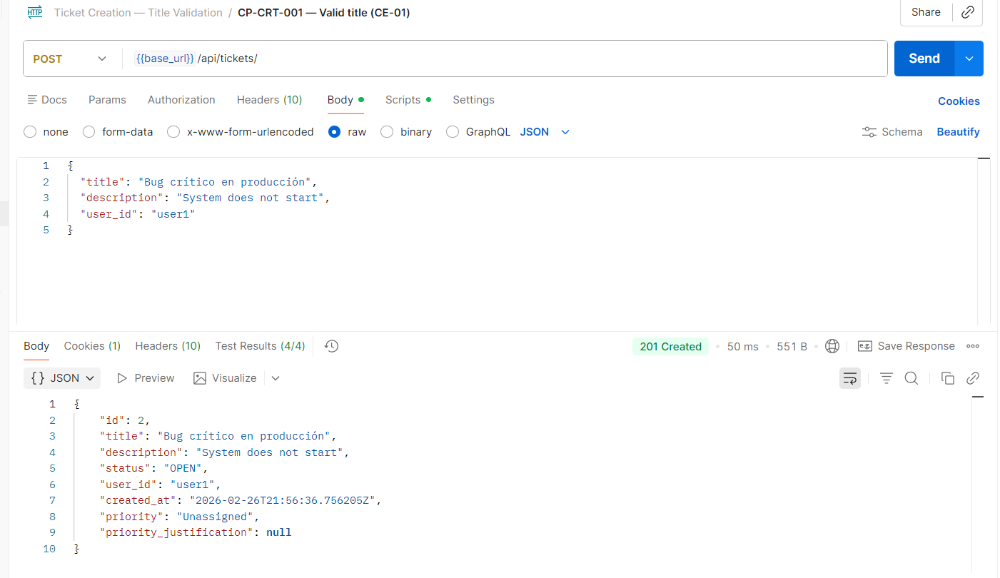
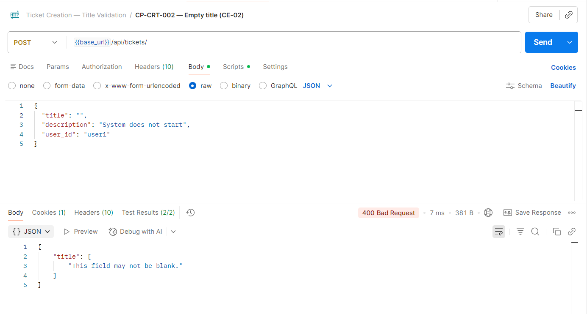
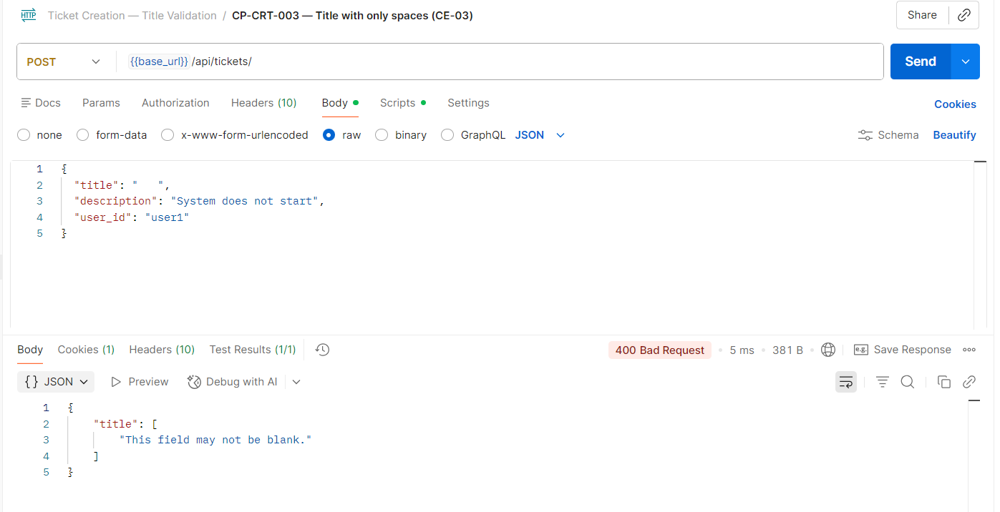
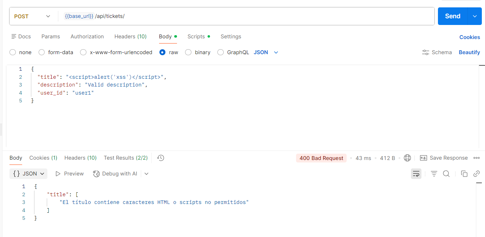
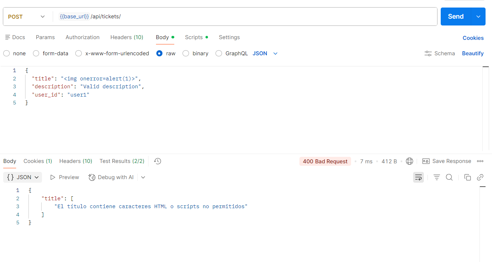
#### 14.1.2 Partición de Equivalencia — Campo `description`

| Clase | Tipo | Representante | Resultado esperado |
|-------|------|---------------|--------------------|
| CE-06 | Válida | `"El sistema no inicia correctamente"` | Ticket creado (201) |
| CE-07 | Inválida — vacío | `""` | Error (400) |
| CE-08 | Inválida — HTML | `"<iframe src='evil.com'></iframe>"` | Error (400) |

```gherkin
Feature: Crear ticket — Validación de descripción (Partición de Equivalencia)

  Scenario: CP-CRT-006 — Creación exitosa con descripción válida (CE-06)
    Given el usuario está autenticado con JWT válido
    When envío una solicitud POST a "/api/tickets/" con los datos:
      | title      | description                           | user_id |
      | Bug medio  | El sistema no inicia correctamente    | user1   |
    Then la respuesta tiene código de estado 201

  Scenario: CP-CRT-007 — Rechazo por descripción vacía (CE-07)
    Given el usuario está autenticado con JWT válido
    When envío una solicitud POST a "/api/tickets/" con los datos:
      | title      | description | user_id |
      | Bug medio  |             | user1   |
    Then la respuesta tiene código de estado 400

  Scenario: CP-CRT-008 — Rechazo por HTML en descripción — XSS (CE-08)
    Given el usuario está autenticado con JWT válido
    When envío una solicitud POST a "/api/tickets/" con los datos:
      | title      | description                             | user_id |
      | Bug medio  | <iframe src='evil.com'></iframe>         | user1   |
    Then la respuesta tiene código de estado 400
```
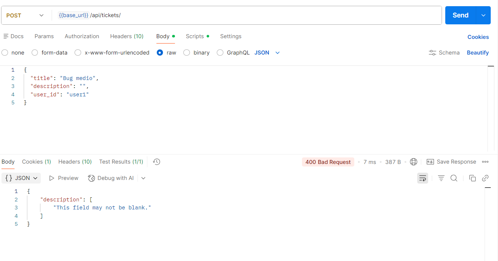

#### 14.1.3 Tabla de Decisión — Crear ticket

| # | title válido | title sin HTML | description válida | description sin HTML | user_id válido | Resultado | HTTP |
|:-:|:------------:|:--------------:|:------------------:|:--------------------:|:--------------:|-----------|:----:|
| 1 | ✅ | ✅ | ✅ | ✅ | ✅ | Ticket creado con status=OPEN, priority=Unassigned, evento publicado | 201 |
| 2 | ❌ | — | ✅ | ✅ | ✅ | Error: título vacío | 400 |
| 3 | ✅ | ❌ | ✅ | ✅ | ✅ | Error: HTML en título | 400 |
| 4 | ✅ | ✅ | ❌ | — | ✅ | Error: descripción vacía | 400 |
| 5 | ✅ | ✅ | ✅ | ❌ | ✅ | Error: HTML en descripción | 400 |
| 6 | ✅ | ✅ | ✅ | ✅ | ❌ | Error: user_id vacío | 400 |

```gherkin
Feature: Crear ticket — Tabla de Decisión

  Scenario: CP-CRT-009 — Regla 1: Todos los campos válidos
    Given el usuario está autenticado con JWT válido
    When envío una solicitud POST a "/api/tickets/" con los datos:
      | title          | description          | user_id |
      | Bug producción | Sistema no inicia    | user1   |
    Then la respuesta tiene código de estado 201
    And la respuesta contiene el campo "status" igual a "OPEN"
    And la respuesta contiene el campo "priority" igual a "Unassigned"

  Scenario: CP-CRT-010 — Regla 2: Título vacío
    Given el usuario está autenticado con JWT válido
    When envío una solicitud POST a "/api/tickets/" con título vacío
    Then la respuesta tiene código de estado 400

  Scenario: CP-CRT-011 — Regla 3: HTML en título
    Given el usuario está autenticado con JWT válido
    When envío una solicitud POST a "/api/tickets/" con título "<b>bold</b>"
    Then la respuesta tiene código de estado 400

  Scenario: CP-CRT-012 — Regla 6: user_id vacío
    Given el usuario está autenticado con JWT válido
    When envío una solicitud POST a "/api/tickets/" con user_id vacío
    Then la respuesta tiene código de estado 400
```

---

### 15.2 Cambiar Estado de Ticket (`PATCH /api/tickets/{id}/status/`)

#### 14.2.1 Partición de Equivalencia — Campo `status`

| Clase | Tipo | Representante | Resultado esperado |
|-------|------|---------------|--------------------|
| CE-09 | Válida | `"IN_PROGRESS"` desde OPEN | Cambio exitoso (200) |
| CE-10 | Válida | `"CLOSED"` desde IN_PROGRESS | Cambio exitoso (200) |
| CE-11 | Inválida — transición directa | `"CLOSED"` desde OPEN | Error (400) |
| CE-12 | Inválida — ticket cerrado | `"OPEN"` desde CLOSED | Error (400) |
| CE-13 | Inválida — estado inválido | `"INVALID_STATE"` | Error (400) |
| CE-14 | Inválida — campo ausente | Sin campo `status` | Error (400) |
| CE-15 | Inválida — ticket no existe | ticket_id=999 | Error (404) |

```gherkin
Feature: Cambiar estado de ticket (Partición de Equivalencia)

  Scenario: CP-STS-001 — Cambio exitoso OPEN → IN_PROGRESS (CE-09)
    Given existe un ticket con id 1 en estado OPEN
    When envío PATCH a "/api/tickets/1/status/" con los datos:
      | status       |
      | IN_PROGRESS  |
    Then la respuesta tiene código de estado 200
    And la respuesta contiene el campo "status" igual a "IN_PROGRESS"

  Scenario: CP-STS-002 — Cambio exitoso IN_PROGRESS → CLOSED (CE-10)
    Given existe un ticket con id 1 en estado IN_PROGRESS
    When envío PATCH a "/api/tickets/1/status/" con los datos:
      | status  |
      | CLOSED  |
    Then la respuesta tiene código de estado 200
    And la respuesta contiene el campo "status" igual a "CLOSED"

  Scenario: CP-STS-003 — Transición inválida OPEN → CLOSED (CE-11)
    Given existe un ticket con id 1 en estado OPEN
    When envío PATCH a "/api/tickets/1/status/" con los datos:
      | status  |
      | CLOSED  |
    Then la respuesta tiene código de estado 400
    And la respuesta contiene un mensaje de error sobre transición no permitida

  Scenario: CP-STS-004 — Ticket cerrado rechaza cambio (CE-12)
    Given existe un ticket con id 1 en estado CLOSED
    When envío PATCH a "/api/tickets/1/status/" con los datos:
      | status       |
      | IN_PROGRESS  |
    Then la respuesta tiene código de estado 400
    And la respuesta contiene un mensaje de error sobre ticket cerrado

  Scenario: CP-STS-005 — Estado inválido (CE-13)
    Given existe un ticket con id 1
    When envío PATCH a "/api/tickets/1/status/" con los datos:
      | status        |
      | INVALID_STATE |
    Then la respuesta tiene código de estado 400
    And la respuesta contiene un mensaje de error sobre estado inválido

  Scenario: CP-STS-006 — Campo 'status' ausente (CE-14)
    Given existe un ticket con id 1
    When envío PATCH a "/api/tickets/1/status/" sin campo status
    Then la respuesta tiene código de estado 400
    And la respuesta contiene {"error": "El campo 'status' es requerido"}

  Scenario: CP-STS-007 — Ticket inexistente devuelve 404 (CE-15)
    Given un ticket con id 999 NO existe
    When envío PATCH a "/api/tickets/999/status/" con los datos:
      | status  |
      | CLOSED  |
    Then la respuesta tiene código de estado 404
    And la respuesta contiene {"error": "Ticket 999 no encontrado"}
```
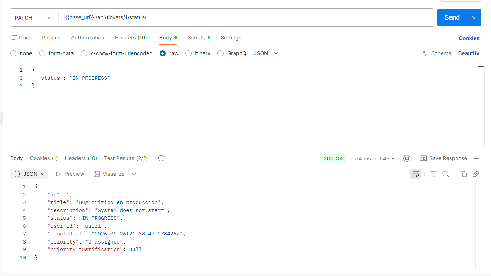
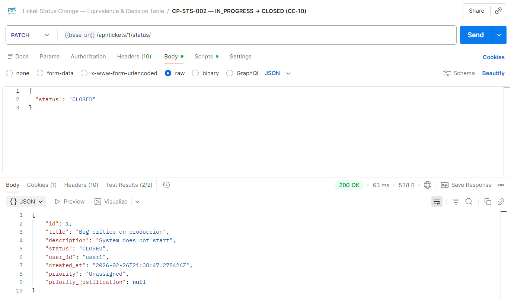
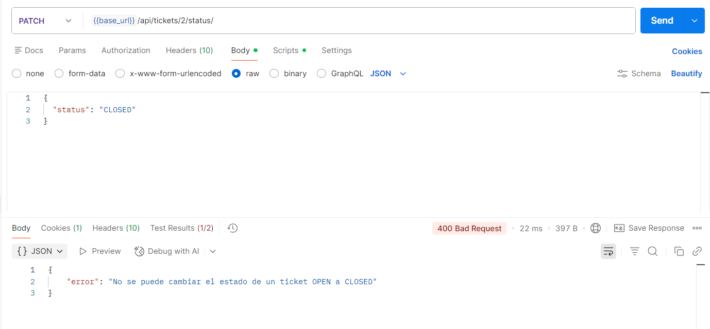
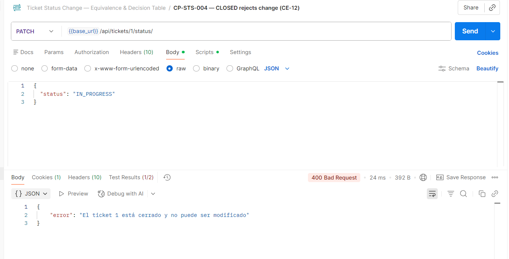
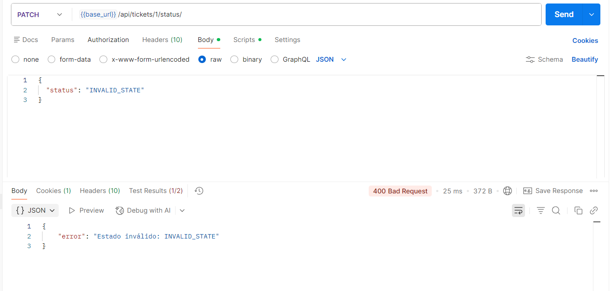
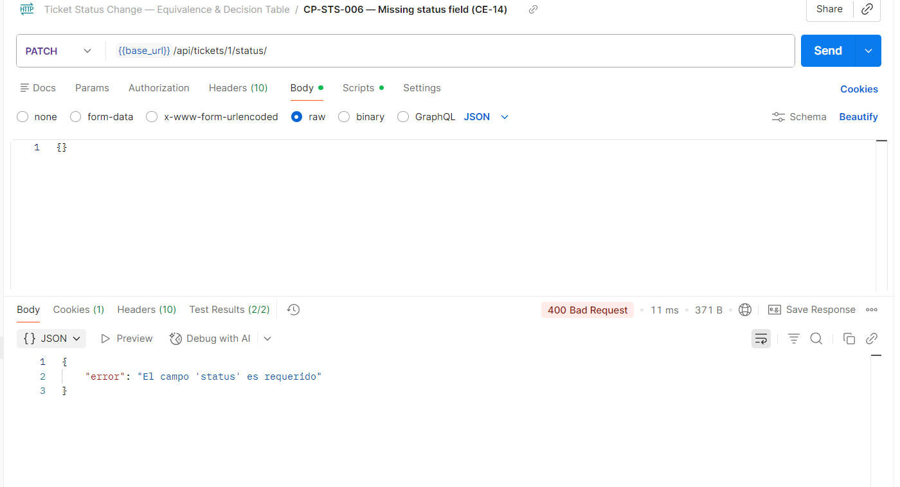
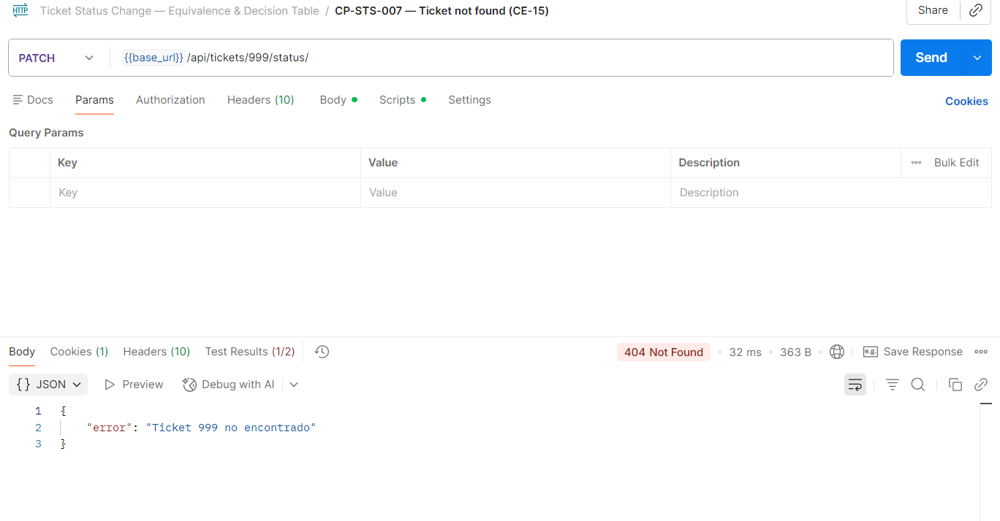
#### 14.2.2 Tabla de Decisión — Cambiar estado

| # | ticket existe | ticket no cerrado | status válido | transición válida | Resultado | HTTP |
|:-:|:------------:|:-----------------:|:-------------:|:-----------------:|-----------|:----:|
| 1 | ✅ | ✅ | ✅ | ✅ | Estado cambiado, evento `TicketStatusChanged` publicado | 200 |
| 2 | ❌ | — | ✅ | — | Ticket no encontrado | 404 |
| 3 | ✅ | ❌ | ✅ | — | Ticket cerrado no permite cambios | 400 |
| 4 | ✅ | ✅ | ❌ | — | Estado inválido | 400 |
| 5 | ✅ | ✅ | ✅ | ❌ | Transición no permitida (OPEN → CLOSED) | 400 |
| 6 | ✅ | ✅ | — | — | Campo 'status' ausente | 400 |
| 7 | ✅ | ✅ | ✅ | ✅ | Excepción inesperada → 500 genérico | 500 |

```gherkin
Feature: Cambiar estado de ticket — Tabla de Decisión

  Scenario: CP-STS-008 — Regla 1: Ticket existe, abierto, transición válida
    Given existe un ticket con id 1 en estado OPEN
    When envío PATCH a "/api/tickets/1/status/" con {"status": "IN_PROGRESS"}
    Then la respuesta tiene código de estado 200

  Scenario: CP-STS-009 — Regla 2: Ticket no existe
    Given un ticket con id 999 NO existe
    When envío PATCH a "/api/tickets/999/status/" con {"status": "IN_PROGRESS"}
    Then la respuesta tiene código de estado 404

  Scenario: CP-STS-010 — Regla 3: Ticket cerrado
    Given existe un ticket con id 1 en estado CLOSED
    When envío PATCH a "/api/tickets/1/status/" con {"status": "OPEN"}
    Then la respuesta tiene código de estado 400

  Scenario: CP-STS-011 — Regla 7: Excepción inesperada
    Given existe un ticket con id 1 y el repositorio lanza una excepción inesperada
    When envío PATCH a "/api/tickets/1/status/" con {"status": "IN_PROGRESS"}
    Then la respuesta tiene código de estado 500
    And la respuesta contiene {"error": "Error interno del servidor"}
    And la respuesta NO contiene stacktrace
```

---

### 15.3 Cambiar Prioridad de Ticket (`PATCH /api/tickets/{id}/priority/`)

#### 14.3.1 Partición de Equivalencia — Campo `priority`

| Clase | Tipo | Representante | Resultado esperado |
|-------|------|---------------|--------------------|
| CE-16 | Válida | `"High"` con rol ADMIN | Cambio exitoso (200) |
| CE-17 | Válida | `"Medium"` con justificación | Cambio exitoso (200) |
| CE-18 | Inválida — prioridad inválida | `"Urgent"` | Error (400) |
| CE-19 | Inválida — volver a Unassigned | `"Unassigned"` desde Medium | Error (400) |
| CE-20 | Inválida — ticket cerrado | Cualquier prioridad, ticket CLOSED | Error (400) |
| CE-21 | Inválida — sin rol ADMIN | `"High"` con rol USER | Error (403) |
| CE-22 | Inválida — ticket no existe | ticket_id=999 | Error (404) |
| CE-23 | Inválida — campo ausente | Sin campo `priority` | Error (400) |

```gherkin
Feature: Cambiar prioridad de ticket (Partición de Equivalencia)

  Scenario: CP-PRI-001 — Cambio exitoso con rol ADMIN (CE-16)
    Given existe un ticket con id 1 en estado OPEN con prioridad Unassigned
    And el solicitante tiene rol ADMIN
    When envío PATCH a "/api/tickets/1/priority/" con los datos:
      | priority | justification    |
      | High     | Cliente VIP      |
    Then la respuesta tiene código de estado 200
    And la respuesta contiene el campo "priority" igual a "High"

  Scenario: CP-PRI-002 — Prioridad inválida (CE-18)
    Given existe un ticket con id 1
    And el solicitante tiene rol ADMIN
    When envío PATCH a "/api/tickets/1/priority/" con los datos:
      | priority |
      | Urgent   |
    Then la respuesta tiene código de estado 400

  Scenario: CP-PRI-003 — No puede volver a Unassigned (CE-19)
    Given existe un ticket con id 1 con prioridad Medium
    And el solicitante tiene rol ADMIN
    When envío PATCH a "/api/tickets/1/priority/" con los datos:
      | priority    |
      | Unassigned  |
    Then la respuesta tiene código de estado 400
    And la respuesta contiene un mensaje de error sobre transición de prioridad inválida

  Scenario: CP-PRI-004 — Ticket cerrado rechaza cambio (CE-20)
    Given existe un ticket con id 1 en estado CLOSED
    And el solicitante tiene rol ADMIN
    When envío PATCH a "/api/tickets/1/priority/" con los datos:
      | priority |
      | High     |
    Then la respuesta tiene código de estado 400
    And la respuesta contiene un mensaje de error sobre ticket cerrado

  Scenario: CP-PRI-005 — Sin rol ADMIN rechazado (CE-21)
    Given existe un ticket con id 1
    And el solicitante NO tiene rol ADMIN
    When envío PATCH a "/api/tickets/1/priority/" con los datos:
      | priority |
      | High     |
    Then la respuesta tiene código de estado 403

  Scenario: CP-PRI-006 — Ticket inexistente (CE-22)
    Given un ticket con id 999 NO existe
    And el solicitante tiene rol ADMIN
    When envío PATCH a "/api/tickets/999/priority/" con los datos:
      | priority |
      | High     |
    Then la respuesta tiene código de estado 404

  Scenario: CP-PRI-007 — Campo 'priority' ausente (CE-23)
    Given existe un ticket con id 1
    And el solicitante tiene rol ADMIN
    When envío PATCH a "/api/tickets/1/priority/" sin campo priority
    Then la respuesta tiene código de estado 400
    And la respuesta contiene {"error": "El campo 'priority' es requerido"}
```
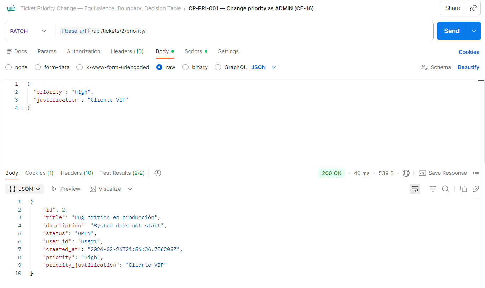
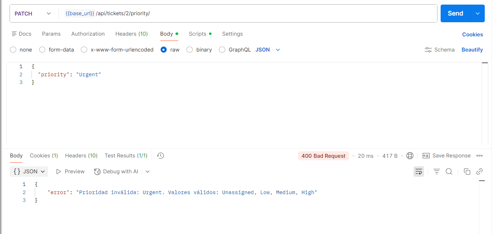
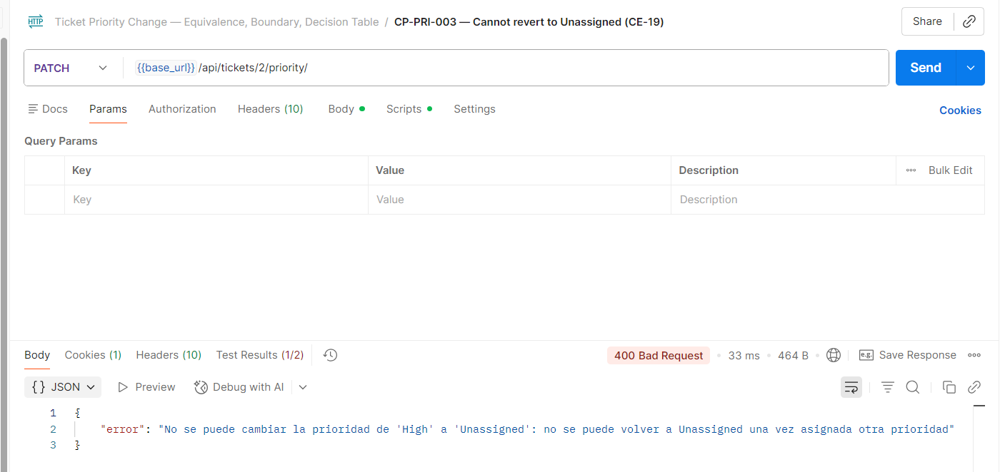
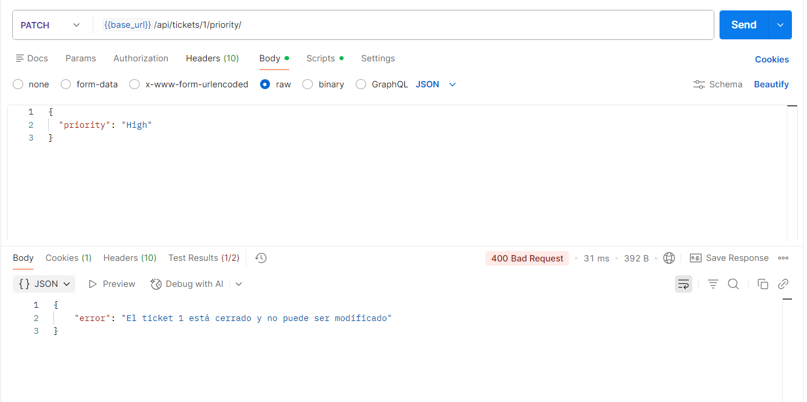
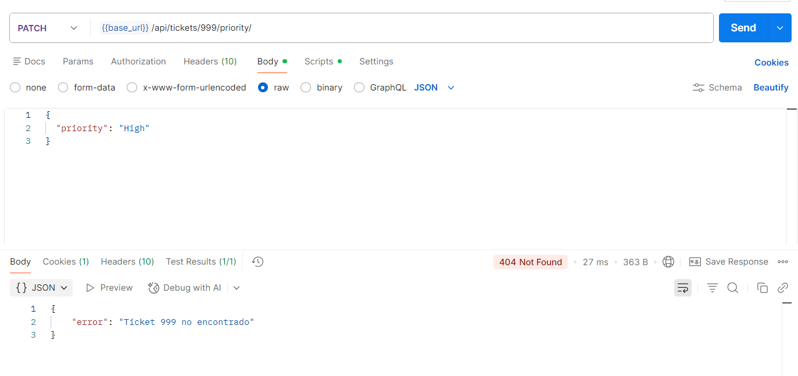
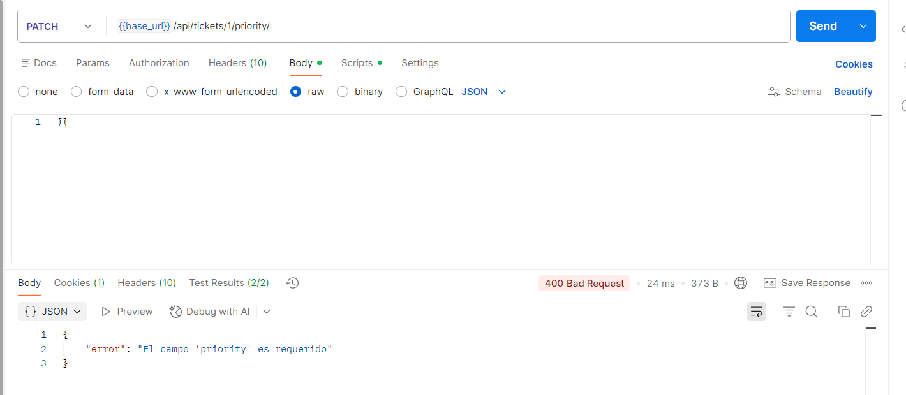
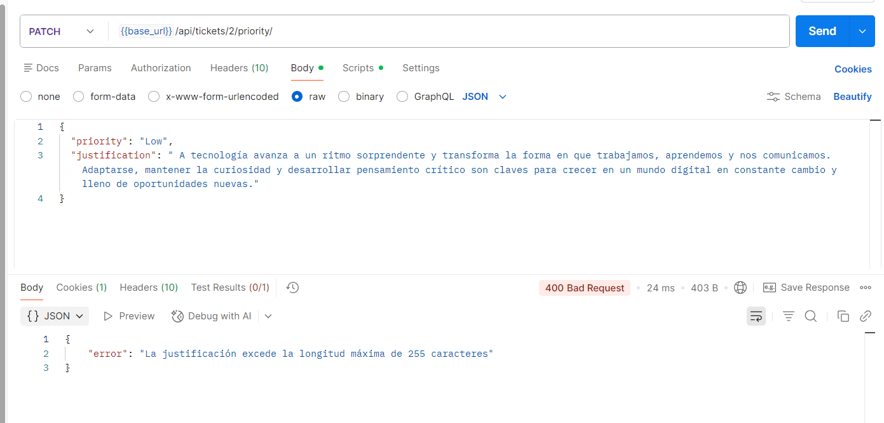
#### 14.3.2 Valores Límite — Campo `justification` (máx. 255 caracteres)

| Valor límite | Longitud | Resultado esperado |
|--------------|:--------:|--------------------|
| `None` | 0 | Cambio exitoso (200) — justificación opcional |
| `"a" * 254` | 254 | Cambio exitoso (200) — debajo del máximo |
| `"a" * 255` | 255 | Cambio exitoso (200) — máximo válido |
| `"a" * 256` | 256 | Error (400) — excede máximo |

```gherkin
Feature: Cambiar prioridad — Validación de justificación (Valores Límite)

  Scenario: CP-PRI-008 — Justificación nula (opcional)
    Given existe un ticket con id 1 con prioridad Unassigned
    And el solicitante tiene rol ADMIN
    When envío PATCH a "/api/tickets/1/priority/" con {"priority": "Low"} sin justificación
    Then la respuesta tiene código de estado 200

  Scenario: CP-PRI-009 — Justificación de 255 caracteres (máximo válido)
    Given existe un ticket con id 1 con prioridad Unassigned
    And el solicitante tiene rol ADMIN
    When envío PATCH a "/api/tickets/1/priority/" con justificación de 255 caracteres
    Then la respuesta tiene código de estado 200

  Scenario: CP-PRI-010 — Justificación de 256 caracteres (excede máximo)
    Given existe un ticket con id 1 con prioridad Unassigned
    And el solicitante tiene rol ADMIN
    When envío PATCH a "/api/tickets/1/priority/" con justificación de 256 caracteres
    Then la respuesta tiene código de estado 400
    And la respuesta contiene un mensaje de error sobre longitud de justificación
```

#### 14.3.3 Tabla de Decisión — Cambiar prioridad

| # | autenticado ADMIN | ticket existe | ticket no cerrado | priority válida | transición válida | Resultado | HTTP |
|:-:|:-----------------:|:------------:|:-----------------:|:---------------:|:-----------------:|-----------|:----:|
| 1 | ✅ | ✅ | ✅ | ✅ | ✅ | Prioridad cambiada, evento `TicketPriorityChanged` publicado | 200 |
| 2 | ❌ | ✅ | ✅ | ✅ | ✅ | Permiso denegado | 403 |
| 3 | ✅ | ❌ | — | ✅ | — | Ticket no encontrado | 404 |
| 4 | ✅ | ✅ | ❌ | ✅ | — | Ticket cerrado | 400 |
| 5 | ✅ | ✅ | ✅ | ❌ | — | Prioridad inválida | 400 |
| 6 | ✅ | ✅ | ✅ | ✅ | ❌ | No puede volver a Unassigned | 400 |

```gherkin
Feature: Cambiar prioridad — Tabla de Decisión

  Scenario: CP-PRI-011 — Regla 1: ADMIN, ticket existe, abierto, transición válida
    Given existe un ticket con id 1 en estado OPEN con prioridad Unassigned
    And el solicitante tiene rol ADMIN
    When envío PATCH a "/api/tickets/1/priority/" con {"priority": "Medium", "justification": "Escalado"}
    Then la respuesta tiene código de estado 200

  Scenario: CP-PRI-012 — Regla 2: Sin rol ADMIN
    Given existe un ticket con id 1
    And el solicitante tiene rol USER
    When envío PATCH a "/api/tickets/1/priority/" con {"priority": "High"}
    Then la respuesta tiene código de estado 403

  Scenario: CP-PRI-013 — Regla 3: Ticket no existe
    Given un ticket con id 999 NO existe
    And el solicitante tiene rol ADMIN
    When envío PATCH a "/api/tickets/999/priority/" con {"priority": "High"}
    Then la respuesta tiene código de estado 404

  Scenario: CP-PRI-014 — Regla 6: Transición inválida (Medium → Unassigned)
    Given existe un ticket con prioridad Medium
    And el solicitante tiene rol ADMIN
    When envío PATCH a "/api/tickets/1/priority/" con {"priority": "Unassigned"}
    Then la respuesta tiene código de estado 400
```

---

### 15.4 Agregar Respuesta a Ticket (`POST /api/tickets/{id}/responses/`)

#### 14.4.1 Partición de Equivalencia — Campos de respuesta

| Clase | Tipo | Representante | Resultado esperado |
|-------|------|---------------|--------------------|
| CE-24 | Válida | text="Investigando", admin_id="admin1", rol ADMIN | Respuesta creada (201) |
| CE-25 | Inválida — texto vacío | text="", admin_id="admin1" | Error (400) |
| CE-26 | Inválida — sin rol ADMIN | text="Prueba", admin_id="user1", rol USER | Error (403) |
| CE-27 | Inválida — ticket cerrado | Ticket en CLOSED | Error (400) |
| CE-28 | Inválida — ticket no existe | ticket_id=999 | Error (404) |

```gherkin
Feature: Agregar respuesta a ticket (Partición de Equivalencia)

  Scenario: CP-RES-001 — Respuesta creada exitosamente (CE-24)
    Given existe un ticket con id 1 en estado OPEN
    And el solicitante tiene rol ADMIN
    When envío POST a "/api/tickets/1/responses/" con los datos:
      | text              | admin_id |
      | Equipo investiga  | admin1   |
    Then la respuesta tiene código de estado 201
    And la respuesta contiene el campo "text" igual a "Equipo investiga"
    And la respuesta contiene el campo "admin_id" igual a "admin1"

  Scenario: CP-RES-002 — Rechazo por texto vacío (CE-25)
    Given existe un ticket con id 1 en estado OPEN
    And el solicitante tiene rol ADMIN
    When envío POST a "/api/tickets/1/responses/" con los datos:
      | text | admin_id |
      |      | admin1   |
    Then la respuesta tiene código de estado 400

  Scenario: CP-RES-003 — Sin rol ADMIN rechazado (CE-26)
    Given existe un ticket con id 1
    And el solicitante NO tiene rol ADMIN
    When envío POST a "/api/tickets/1/responses/" con los datos:
      | text     | admin_id |
      | Prueba   | user1    |
    Then la respuesta tiene código de estado 403

  Scenario: CP-RES-004 — Ticket cerrado rechaza respuesta (CE-27)
    Given existe un ticket con id 1 en estado CLOSED
    And el solicitante tiene rol ADMIN
    When envío POST a "/api/tickets/1/responses/" con los datos:
      | text     | admin_id |
      | Prueba   | admin1   |
    Then la respuesta tiene código de estado 400
    And la respuesta contiene un mensaje de error sobre ticket cerrado

  Scenario: CP-RES-005 — Ticket inexistente (CE-28)
    Given un ticket con id 999 NO existe
    And el solicitante tiene rol ADMIN
    When envío POST a "/api/tickets/999/responses/" con los datos:
      | text     | admin_id |
      | Prueba   | admin1   |
    Then la respuesta tiene código de estado 404
```

#### 14.4.2 Valores Límite — Campo `text` (máx. 2000 caracteres)

| Valor límite | Longitud | Resultado esperado |
|--------------|:--------:|--------------------|
| `""` | 0 | Error (400) — vacío |
| `"a"` | 1 | Respuesta creada (201) — mínimo válido |
| `"a" * 1999` | 1999 | Respuesta creada (201) — debajo del máximo |
| `"a" * 2000` | 2000 | Respuesta creada (201) — máximo válido |
| `"a" * 2001` | 2001 | Error (400) — por encima del máximo |

```gherkin
Feature: Agregar respuesta — Validación de texto (Valores Límite)

  Scenario: CP-RES-006 — Texto vacío rechazado
    Given existe un ticket abierto y el solicitante es ADMIN
    When envío respuesta con texto vacío ""
    Then la respuesta tiene código de estado 400

  Scenario: CP-RES-007 — Texto de 1 carácter (mínimo válido)
    Given existe un ticket abierto y el solicitante es ADMIN
    When envío respuesta con texto "a"
    Then la respuesta tiene código de estado 201

  Scenario: CP-RES-008 — Texto de 2000 caracteres (máximo válido)
    Given existe un ticket abierto y el solicitante es ADMIN
    When envío respuesta con texto de 2000 caracteres
    Then la respuesta tiene código de estado 201

  Scenario: CP-RES-009 — Texto de 2001 caracteres (excede máximo)
    Given existe un ticket abierto y el solicitante es ADMIN
    When envío respuesta con texto de 2001 caracteres
    Then la respuesta tiene código de estado 400
    And la respuesta contiene un mensaje de error sobre longitud máxima
```

#### 14.4.3 Tabla de Decisión — Agregar respuesta

| # | rol ADMIN | ticket existe | ticket no cerrado | text válido | Resultado | HTTP |
|:-:|:---------:|:------------:|:-----------------:|:-----------:|-----------|:----:|
| 1 | ✅ | ✅ | ✅ | ✅ | Respuesta creada, evento `TicketResponseAdded` publicado | 201 |
| 2 | ❌ | ✅ | ✅ | ✅ | Permiso denegado | 403 |
| 3 | ✅ | ❌ | — | ✅ | Ticket no encontrado | 404 |
| 4 | ✅ | ✅ | ❌ | ✅ | Ticket cerrado | 400 |
| 5 | ✅ | ✅ | ✅ | ❌ | Texto vacío u obligatorio | 400 |

```gherkin
Feature: Agregar respuesta — Tabla de Decisión

  Scenario: CP-RES-010 — Regla 1: ADMIN, ticket abierto, texto válido
    Given existe un ticket abierto con id 1
    And el solicitante tiene rol ADMIN
    When envío POST a "/api/tickets/1/responses/" con {"text": "Resuelto", "admin_id": "admin1"}
    Then la respuesta tiene código de estado 201

  Scenario: CP-RES-011 — Regla 2: Sin rol ADMIN
    Given existe un ticket abierto con id 1
    And el solicitante tiene rol USER
    When envío POST a "/api/tickets/1/responses/" con {"text": "Prueba", "admin_id": "user1"}
    Then la respuesta tiene código de estado 403

  Scenario: CP-RES-012 — Regla 3: Ticket no existe
    Given un ticket con id 999 NO existe
    When envío POST a "/api/tickets/999/responses/" con {"text": "Prueba", "admin_id": "admin1"}
    Then la respuesta tiene código de estado 404

  Scenario: CP-RES-013 — Regla 4: Ticket cerrado
    Given existe un ticket cerrado con id 1
    When envío POST a "/api/tickets/1/responses/" con {"text": "Prueba", "admin_id": "admin1"}
    Then la respuesta tiene código de estado 400
```

---

### 15.5 Deshabilitar Métodos Heredados (US-001)

#### 14.5.1 Partición de Equivalencia — Métodos HTTP

| Clase | Tipo | Representante | Resultado esperado |
|-------|------|---------------|--------------------|
| CE-29 | Inválida | `PUT /api/tickets/{id}/` | 405 Method Not Allowed |
| CE-30 | Inválida | `PATCH /api/tickets/{id}/` | 405 Method Not Allowed |
| CE-31 | Inválida | `DELETE /api/tickets/{id}/` | 405 Method Not Allowed |
| CE-32 | Válida | `PATCH /api/tickets/{id}/status/` | Operación exitosa |
| CE-33 | Válida | `PATCH /api/tickets/{id}/priority/` | Operación exitosa |
| CE-34 | Válida | `POST /api/tickets/{id}/responses/` | Operación exitosa |

```gherkin
Feature: Deshabilitar métodos heredados (Partición de Equivalencia)

  Scenario: CP-DIS-001 — PUT genérico devuelve 405 (CE-29)
    Given un ticket con id 1 existe en la base de datos
    When se envía una solicitud PUT a "/api/tickets/1/" con {"title": "Nuevo"}
    Then la respuesta es 405 Method Not Allowed
    And el ticket NO ha sido modificado en la base de datos

  Scenario: CP-DIS-002 — PATCH genérico devuelve 405 (CE-30)
    Given un ticket con id 1 existe en la base de datos
    When se envía una solicitud PATCH a "/api/tickets/1/" con {"title": "Nuevo"}
    Then la respuesta es 405 Method Not Allowed
    And el ticket NO ha sido modificado en la base de datos

  Scenario: CP-DIS-003 — DELETE genérico devuelve 405 (CE-31)
    Given un ticket con id 1 existe en la base de datos
    When se envía una solicitud DELETE a "/api/tickets/1/"
    Then la respuesta es 405 Method Not Allowed
    And el ticket se mantiene intacto en la base de datos

  Scenario: CP-DIS-004 — Endpoint custom /status/ sigue funcionando (CE-32)
    Given un ticket con id 1 en estado OPEN existe
    When se envía PATCH a "/api/tickets/1/status/" con {"status": "IN_PROGRESS"}
    Then la respuesta es 200 OK
    And el ticket tiene status IN_PROGRESS

  Scenario: CP-DIS-005 — Endpoint custom /priority/ sigue funcionando (CE-33)
    Given un ticket con id 1 existe
    And el solicitante tiene rol ADMIN
    When se envía PATCH a "/api/tickets/1/priority/" con {"priority": "High", "justification": "Urgente"}
    Then la respuesta es 200 OK

  Scenario: CP-DIS-006 — Endpoint custom /responses/ sigue funcionando (CE-34)
    Given un ticket con id 1 existe
    And el solicitante tiene rol ADMIN
    When se envía POST a "/api/tickets/1/responses/" con {"text": "Resuelto", "admin_id": "admin1"}
    Then la respuesta es 201 Created
```

---

### 15.6 Manejo Genérico de Errores 500 (US-003)

#### 14.6.1 Tabla de Decisión — Excepciones en endpoints

| # | Excepción | Endpoint | Resultado | HTTP |
|:-:|-----------|----------|-----------|:----:|
| 1 | `Exception` (inesperada) | `PATCH .../status/` | `{"error": "Error interno del servidor"}` sin stacktrace | 500 |
| 2 | `Exception` (inesperada) | `PATCH .../priority/` | `{"error": "Error interno del servidor"}` sin stacktrace | 500 |
| 3 | `ValueError` (prevista) | `PATCH .../status/` | Error descriptivo | 400 |
| 4 | `TicketAlreadyClosed` | `PATCH .../status/` | Error sobre ticket cerrado | 400 |
| 5 | `TicketNotFoundException` | `PATCH .../status/` | Ticket no encontrado | 404 |
| 6 | `DomainException` (permiso) | `PATCH .../priority/` | Permiso denegado | 403 |
| 7 | `Exception` (inesperada) | `GET .../my-tickets/` | `{"error": "Error interno del servidor"}` | 500 |

```gherkin
Feature: Manejo genérico de errores 500 (Tabla de Decisión)

  Scenario: CP-500-001 — Excepción inesperada en change_status devuelve 500
    Given un ticket con id 1 existe
    And ocurre una excepción inesperada en el repositorio
    When se envía PATCH a "/api/tickets/1/status/" con {"status": "IN_PROGRESS"}
    Then la respuesta es 500 Internal Server Error
    And el cuerpo es {"error": "Error interno del servidor"}
    And NO aparece stacktrace en la respuesta

  Scenario: CP-500-002 — Excepción inesperada en change_priority devuelve 500
    Given un ticket con id 1 existe
    And ocurre una excepción inesperada
    When se envía PATCH a "/api/tickets/1/priority/" con {"priority": "High"}
    Then la respuesta es 500 Internal Server Error
    And el cuerpo es {"error": "Error interno del servidor"}

  Scenario: CP-500-003 — ValueError sigue siendo 400
    Given un ticket con id 1 existe
    When se envía PATCH a "/api/tickets/1/status/" con {"status": "INVALID_STATE"}
    Then la respuesta es 400 Bad Request

  Scenario: CP-500-004 — TicketAlreadyClosed sigue siendo 400
    Given un ticket con id 1 está CLOSED
    When se envía PATCH a "/api/tickets/1/status/" con {"status": "IN_PROGRESS"}
    Then la respuesta es 400 Bad Request

  Scenario: CP-500-005 — TicketNotFoundException sigue siendo 404
    Given un ticket con id 999 NO existe
    When se envía PATCH a "/api/tickets/999/status/" con {"status": "CLOSED"}
    Then la respuesta es 404 Not Found

  Scenario: CP-500-006 — DomainException (permiso) sigue siendo 403
    Given un ticket con id 1 existe
    And el solicitante NO tiene rol ADMIN
    When se envía PATCH a "/api/tickets/1/priority/" con {"priority": "High"}
    Then la respuesta es 403 Forbidden

  Scenario: CP-500-007 — Excepción en my_tickets devuelve 500
    Given el endpoint GET /api/tickets/my-tickets/{user_id}/ existe
    And ocurre una excepción inesperada
    When se accede al endpoint
    Then la respuesta es 500 Internal Server Error
```

---

### 15.7 Entidad de Dominio — Máquina de Estados

#### 14.7.1 Tabla de Decisión — Método `change_status()`

| # | Estado actual | Nuevo estado | Resultado | Evento generado |
|:-:|:------------:|:------------:|-----------|:---------------:|
| 1 | OPEN | IN_PROGRESS | Status cambiado | `TicketStatusChanged` ✅ |
| 2 | IN_PROGRESS | CLOSED | Status cambiado | `TicketStatusChanged` ✅ |
| 3 | OPEN | OPEN | Sin cambio (idempotente) | Ninguno ❌ |
| 4 | IN_PROGRESS | IN_PROGRESS | Sin cambio (idempotente) | Ninguno ❌ |
| 5 | OPEN | CLOSED | `InvalidTicketStateTransition` | Ninguno ❌ |
| 6 | CLOSED | * | `TicketAlreadyClosed` | Ninguno ❌ |
| 7 | * | INVALID | `ValueError` | Ninguno ❌ |

```gherkin
Feature: Entidad Ticket — Método change_status() (Tabla de Decisión)

  Scenario: CP-DOM-001 — Regla 1: OPEN → IN_PROGRESS
    Given existe una entidad Ticket con status "OPEN"
    When se invoca change_status("IN_PROGRESS")
    Then el campo "status" cambia a "IN_PROGRESS"
    And se genera un evento "TicketStatusChanged"

  Scenario: CP-DOM-002 — Regla 2: IN_PROGRESS → CLOSED
    Given existe una entidad Ticket con status "IN_PROGRESS"
    When se invoca change_status("CLOSED")
    Then el campo "status" cambia a "CLOSED"
    And se genera un evento "TicketStatusChanged"

  Scenario: CP-DOM-003 — Regla 3: OPEN → OPEN (idempotente)
    Given existe una entidad Ticket con status "OPEN"
    When se invoca change_status("OPEN")
    Then el campo "status" permanece "OPEN"
    And no se genera ningún evento

  Scenario: CP-DOM-004 — Regla 5: OPEN → CLOSED (inválida)
    Given existe una entidad Ticket con status "OPEN"
    When se invoca change_status("CLOSED")
    Then se lanza la excepción "InvalidTicketStateTransition"

  Scenario: CP-DOM-005 — Regla 6: CLOSED → cualquier estado
    Given existe una entidad Ticket con status "CLOSED"
    When se invoca change_status("OPEN")
    Then se lanza la excepción "TicketAlreadyClosed"

  Scenario: CP-DOM-006 — Regla 7: Estado inválido
    Given existe una entidad Ticket con status "OPEN"
    When se invoca change_status("INVALID")
    Then se lanza la excepción "ValueError"
```

---

### 15.8 Entidad de Dominio — Prioridad

#### 14.8.1 Tabla de Decisión — Método `change_priority()`

| # | ticket cerrado | priority válida | transición válida | justificación OK | Resultado | Evento |
|:-:|:-------------:|:---------------:|:-----------------:|:----------------:|-----------|:------:|
| 1 | ❌ | ✅ | ✅ | ✅ | Prioridad cambiada | `TicketPriorityChanged` ✅ |
| 2 | ✅ | ✅ | — | — | `TicketAlreadyClosed` | Ninguno ❌ |
| 3 | ❌ | ❌ | — | — | `ValueError` | Ninguno ❌ |
| 4 | ❌ | ✅ | ❌ | — | `InvalidPriorityTransition` | Ninguno ❌ |
| 5 | ❌ | ✅ | ✅ | ❌ (>255) | `ValueError` | Ninguno ❌ |
| 6 | ❌ | ✅ | ✅ (misma) | — | Sin cambio (idempotente) | Ninguno ❌ |

```gherkin
Feature: Entidad Ticket — Método change_priority() (Tabla de Decisión)

  Scenario: CP-DOM-007 — Regla 1: Cambio válido
    Given existe una entidad Ticket abierta con prioridad "Unassigned"
    When se invoca change_priority("High", justification="Urgente")
    Then el campo "priority" cambia a "High"
    And se genera un evento "TicketPriorityChanged"

  Scenario: CP-DOM-008 — Regla 2: Ticket cerrado
    Given existe una entidad Ticket con status "CLOSED"
    When se invoca change_priority("High")
    Then se lanza la excepción "TicketAlreadyClosed"

  Scenario: CP-DOM-009 — Regla 3: Prioridad inválida
    Given existe una entidad Ticket abierta
    When se invoca change_priority("Urgent")
    Then se lanza la excepción "ValueError"

  Scenario: CP-DOM-010 — Regla 4: Volver a Unassigned
    Given existe una entidad Ticket con prioridad "Medium"
    When se invoca change_priority("Unassigned")
    Then se lanza la excepción "InvalidPriorityTransition"

  Scenario: CP-DOM-011 — Regla 5: Justificación excede 255 chars
    Given existe una entidad Ticket abierta con prioridad "Unassigned"
    When se invoca change_priority("High", justification="a" * 256)
    Then se lanza la excepción "ValueError"

  Scenario: CP-DOM-012 — Regla 6: Misma prioridad (idempotente)
    Given existe una entidad Ticket con prioridad "Medium"
    When se invoca change_priority("Medium")
    Then no se genera ningún evento
```

---

### 15.9 Entidad de Dominio — Respuestas

#### 14.9.1 Tabla de Decisión — Método `add_response()`

| # | ticket no cerrado | text no vacío | text ≤ 2000 | Resultado |
|:-:|:-----------------:|:------------:|:-----------:|-----------|
| 1 | ✅ | ✅ | ✅ | Respuesta aceptada |
| 2 | ❌ | ✅ | ✅ | `TicketAlreadyClosed` |
| 3 | ✅ | ❌ | — | `EmptyResponseError` |
| 4 | ✅ | ✅ | ❌ | `ResponseTooLongError` |

```gherkin
Feature: Entidad Ticket — Método add_response() (Tabla de Decisión)

  Scenario: CP-DOM-013 — Regla 1: Respuesta válida
    Given existe una entidad Ticket en estado "OPEN"
    When se invoca add_response("Investigando", "admin1")
    Then la operación se completa sin error

  Scenario: CP-DOM-014 — Regla 2: Ticket cerrado
    Given existe una entidad Ticket en estado "CLOSED"
    When se invoca add_response("Prueba", "admin1")
    Then se lanza la excepción "TicketAlreadyClosed"

  Scenario: CP-DOM-015 — Regla 3: Texto vacío
    Given existe una entidad Ticket en estado "OPEN"
    When se invoca add_response("", "admin1")
    Then se lanza la excepción "EmptyResponseError"

  Scenario: CP-DOM-016 — Regla 4: Texto excede 2000 caracteres
    Given existe una entidad Ticket en estado "OPEN"
    When se invoca add_response("a" * 2001, "admin1")
    Then se lanza la excepción "ResponseTooLongError"
```

---

### 15.10 Factory — Creación de Tickets

#### 14.10.1 Tabla de Decisión — `TicketFactory.create()`

| # | title válido | title sin HTML | description válida | description sin HTML | user_id válido | Resultado |
|:-:|:------------:|:--------------:|:------------------:|:--------------------:|:--------------:|-----------|
| 1 | ✅ | ✅ | ✅ | ✅ | ✅ | Ticket creado con status=OPEN |
| 2 | ❌ (vacío) | — | ✅ | ✅ | ✅ | `InvalidTicketData` |
| 3 | ✅ | ❌ | ✅ | ✅ | ✅ | `DangerousInputError` |
| 4 | ✅ | ✅ | ❌ (vacío) | — | ✅ | `InvalidTicketData` |
| 5 | ✅ | ✅ | ✅ | ❌ | ✅ | `DangerousInputError` |
| 6 | ✅ | ✅ | ✅ | ✅ | ❌ (vacío) | `InvalidTicketData` |

```gherkin
Feature: TicketFactory — Tabla de Decisión

  Scenario: CP-FAC-001 — Regla 1: Todos los campos válidos
    Given se invoca TicketFactory.create
    When se proporcionan title "Bug", description "Descripción", user_id "user1"
    Then el ticket se crea exitosamente con status "OPEN" y priority "Unassigned"

  Scenario: CP-FAC-002 — Regla 2: Título vacío
    Given se invoca TicketFactory.create
    When se proporciona title vacío ""
    Then se lanza la excepción "InvalidTicketData" con mensaje "El título no puede estar vacío"

  Scenario: CP-FAC-003 — Regla 3: HTML en título
    Given se invoca TicketFactory.create
    When se proporciona title "<script>alert(1)</script>"
    Then se lanza la excepción "DangerousInputError"

  Scenario: CP-FAC-004 — Regla 4: Descripción vacía
    Given se invoca TicketFactory.create
    When se proporciona description vacía ""
    Then se lanza la excepción "InvalidTicketData"

  Scenario: CP-FAC-005 — Regla 5: HTML en descripción
    Given se invoca TicketFactory.create
    When se proporciona description "<iframe src='evil'></iframe>"
    Then se lanza la excepción "DangerousInputError"

  Scenario: CP-FAC-006 — Regla 6: user_id vacío
    Given se invoca TicketFactory.create
    When se proporciona user_id vacío ""
    Then se lanza la excepción "InvalidTicketData"
```

---

### 15.11 E2E — Flujos Completos (STORY-1.1)

```gherkin
Feature: Tests E2E de flujos completos

  Scenario: CP-E2E-001 — Flujo completo: Crear → IN_PROGRESS → CLOSED
    Given que tengo credenciales válidas
    When creo un ticket con POST /api/tickets/:
      | title       | description       | user_id |
      | Bug crítico | Sistema no inicia | user1   |
    Then recibo status 201 con status=OPEN

    When cambio estado a IN_PROGRESS con PATCH /api/tickets/{id}/status/:
      | status       |
      | IN_PROGRESS  |
    Then recibo status 200 con status=IN_PROGRESS

    When cambio estado a CLOSED con PATCH /api/tickets/{id}/status/:
      | status  |
      | CLOSED  |
    Then recibo status 200 con status=CLOSED

  Scenario: CP-E2E-002 — Flujo con prioridad y respuestas
    Given que tengo credenciales válidas y rol ADMIN
    When creo un ticket y lo cambio a priority Medium:
      | priority | justification     |
      | Medium   | Cliente importante |
    Then recibo status 200 con priority=Medium

    When agrego una respuesta con POST /api/tickets/{id}/responses/:
      | text                        | admin_id |
      | El equipo está investigando | admin1   |
    Then recibo status 201
    And GET /api/tickets/{id}/ incluye la respuesta

  Scenario: CP-E2E-003 — Validación de errores en flujo
    Given que creo un ticket y lo llevo a estado CLOSED
    When intento cambiar estado a OPEN con PATCH /api/tickets/{id}/status/:
      | status |
      | OPEN   |
    Then recibo status 400
    And el cuerpo contiene error sobre ticket cerrado

  Scenario: CP-E2E-004 — Performance con 500+ tickets
    Given existen 500 tickets en BD
    When hago GET /api/tickets/
    Then recibo respuesta en <500ms
```

---

### 15.12 Resumen de Cobertura por Técnica de Diseño

| Técnica | Casos de Prueba | Funcionalidades Cubiertas |
|---------|:---------------:|---------------------------|
| **Partición de Equivalencia (PE)** | 34 clases (CE-01 a CE-34) | Crear ticket, Cambiar estado, Cambiar prioridad, Agregar respuesta, Deshabilitar métodos |
| **Valores Límite (VL)** | 9 escenarios | justificación (254, 255, 256 chars), texto respuesta (0, 1, 2000, 2001 chars) |
| **Tabla de Decisión (TD)** | 10 tablas, 48 reglas | Crear ticket (6), Cambiar estado (7), Cambiar prioridad (6), Agregar respuesta (5), Errores 500 (7), change_status() (7), change_priority() (6), add_response() (4), Factory (6), E2E (4) |

| Total de escenarios Gherkin | **72** |
|-----------------------------|:------:|

---

*Documento generado el 26 de febrero de 2026.*  
*Basado en el estándar ISO/IEC 25010:2023 — Modelo de calidad de producto de software.*  
*Historias de usuario definidas en USERSTORIES_Y_CRITERIOS_ACEPTACION.md.*
